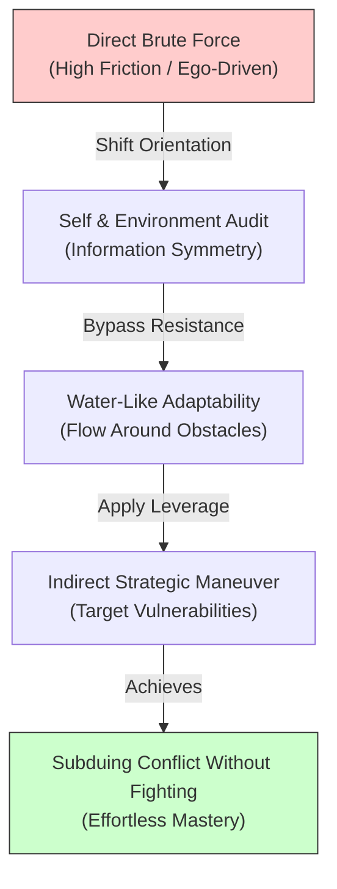

# Sun Tzu: Strategic Adaptability & The Art of Indirect Victory

> **Core Insight (TL;DR):** Supreme strategic mastery consists not of winning a hundred battles through attrition and direct force, but of subduing opposition before conflict ever materializes. By cultivating water-like adaptability (*Wu Wei* / *Sattvic* fluidity) and mastering information asymmetry—deeply understanding both your own psychological architecture and your environment—you eliminate unnecessary friction, disarm egoic confrontation, and secure indirect victory.

---

## 1. The Surface Struggle vs. The Hidden Mechanism

### The Surface Struggle
When confronted with obstacles, competing interests, or internal resistance, most individuals default to brute force. They push harder against stubborn boundaries, engage in exhausting arguments, or attempt to power through cognitive blockages using sheer willpower. On the surface, this head-on approach feels noble and courageous—it looks like determination, discipline, and refusal to back down. Yet despite immense energy expenditure, this strategy frequently yields diminishing returns, severe emotional burnout, heightened interpersonal conflict, and predictable tactical failure.

### The Hidden Mechanism
Psychologically and strategic analysis reveals why direct confrontation so consistently backfires:

1. **Egoic Validation (*Ahamkara* Trap):** The ego craves explicit, visible triumph. Direct confrontation satisfies the ego’s desire to prove strength, even when an indirect maneuver would achieve the goal with ten percent of the energy.
2. **Newtonian Resistance & Amygdala Reactivity:** In social and psychological systems, applying direct pressure triggers an equal and opposite counter-pressure. Pushing directly against a person or a stubborn habit activates their (or your) amygdala-driven fight-or-flight defense mechanisms, hardening resistance rather than dissolving it.
3. **Information Blindspots (Ignoring Self and Other):** Sun Tzu famously noted that those who know neither themselves nor their opponents will succumb in every battle. Operating blindly based on rigid desires without evaluating internal psychological flaws (*samskaras*) or external environmental dynamics ensures predictable failure.

```
   [ DIRECT BRUTE-FORCE STRATEGY ]
   Ego Demand ──> Direct Head-on Assault ──> Amygdala Counter-Defense ──> High Friction & Attrition

   [ SUN TZU INDIRECT ADAPTABILITY ]
   Self & Other Mapping ──> Strategic Avoidance of Strength ──> Fluid Adaptation ──> Effortless Victory
```

---

## 2. The Science & Philosophy Behind It

### Neurobiological Blueprint
* **Prefrontal Executive Modulation vs. Amygdalar Hijack:** Direct conflict engages the sympathetic nervous system, flooding the brain with cortisol and adrenaline. This narrows prefrontal cortex (PFC) executive functioning, trapping the mind in rigid, binary threat-response loops. Strategic indirectness relies on maintaining parasympathetic vagal tone, allowing the PFC and Anterior Cingulate Cortex (ACC) to assess complex situational variables without triggering defensive alarm circuits.
* **Salience Network & Pattern Recognition:** The brain's salience network filters incoming information to highlight leverage points. Sun Tzu’s emphasis on "knowing the enemy and knowing oneself" translates neurobiologically to high interoceptive awareness (via the insular cortex) paired with refined external environmental tracking.
* **Dopaminergic Conservation:** Brute-force grinding exhausts mesolimbic dopamine reserves, leading to behavioral fatigue. Strategic conservation of force keeps dopamine baseline stable for high-leverage execution.

### Yogic / Cognitive Perspective
* **Water-Like Fluidity (*Sattva* & *Taoist Wu Wei*):** Sun Tzu’s doctrine that military tactics should resemble water—conforming to the shape of the terrain—reflects pure *Sattvic* clarity. Water avoids high ground and seeks low ground; it does not fight the rock, yet wears it away effortlessly.
* **Dissolution of *Ahamkara* (Ego):** Subduing the enemy without fighting requires complete detachment from personal pride. When *Ahamkara* is surrendered, one no longer feels compelled to display strength, enabling stealth, strategic positioning, and deception.
* **Chitta Vrittis & Information Asymmetry:** Fluctuations of the mind (*Chitta Vrittis*) distort appraisal. Self-knowledge (*Atma-Jnana*) eliminates internal blind spots, while objective observation reveals the opponent's unstable mental state (*Rajas* or *Tamas*).

---

## 3. The Paradigm Shift

Victory is not achieved by smashing through obstacles, but by positioning yourself so that failure for the opposing force—or internal obstacle—becomes mathematically inevitable.



### The Core Reframes
1. **Avoid Strength, Strike Emptiness:** Never engage an obstacle where it is strongest. Find the structural gap, the unexamined habit loop, or the unmonitored flank.
2. **Adapt Form to Circumstance:** Formlessness is the ultimate defense. If you hold no rigid identity or inflexible plan, you cannot be attacked or trapped.
3. **Win Before Fighting:** The supreme general calculates victory before the battle is joined. Strategy is not what you do during crisis, but how you arrange conditions beforehand.

---

## 4. Actionable Protocol & Implementation Guide

### Phase 1: Immediate Micro-Action (Today)
* **The Indirect Leverage Audit:**
  1. Identify one ongoing conflict or goal in your life where you are currently experiencing high friction (e.g., an argument, a stubborn habit like procrastination, or a work bottleneck).
  2. Write down your current approach. Ask: *"How am I using head-on brute force here?"*
  3. Formulate one indirect angle: Instead of fighting the distraction directly, alter your environmental friction (e.g., placing the phone in another room rather than relying on willpower).

### Phase 2: Cognitive & Meditative Practice
* **Nadi Shodhana & Water-Mind Visualization (12 Minutes Daily):**
  1. Sit in a comfortable posture with a straight spine.
  2. Perform **Nadi Shodhana** (Alternate Nostril Breathing) for 6 minutes: Inhale left nostril (4s), exhale right nostril (6s); inhale right (4s), exhale left (6s). This balances autonomic tone and stills *Chitta Vrittis*.
  3. Spend 6 minutes visualizing your mind as fluid water. Visualize incoming stressors or oppositions as heavy rocks thrown into a deep river—the water simply opens, absorbs, flows around, and continues uninterrupted.

### Phase 3: Long-Term Habit Calibration
* **The Dual Awareness Matrix (Weekly Review):**
  * Every Sunday, evaluate your strategic posture across two vectors:
    * **Knowing Self:** What are my active vulnerabilities, exhaustion points, or egoic triggers right now?
    * **Knowing Environment:** What are the actual unstated dynamics, incentives, and structural realities of my current environment or projects?

---

## 5. Diagnostic Self-Inquiry

1. *Where in my life am I currently wasting massive physical or emotional energy attempting to break down a wall, when there is an open door ten feet away?*
2. *Is my desire to engage in this conflict driven by a genuine strategic objective, or is my ego (Ahamkara) demanding to prove itself right?*
3. *If I were forced to achieve my most critical current goal without using any direct pressure or confrontation, what clever indirect path would I take?*

---

## 6. Related Concepts & Next Steps in the Wiki

* [Four Faculties of Mind: Buddhi, Manas, Ahamkara, Chitta](file:///C:/Users/Asus/.gemini/antigravity/scratch/healthygamer_knowledge_base/articles/4.1-four-faculties-of-mind.md)
* [Three Gunas: Sattva, Rajas, Tamas in Mental Regulation](file:///C:/Users/Asus/.gemini/antigravity/scratch/healthygamer_knowledge_base/articles/4.5-three-gunas-sattva-rajas-tamas-mental-regulation.md)
* [Tapas: Building Internal Heat & Willpower](file:///C:/Users/Asus/.gemini/antigravity/scratch/healthygamer_knowledge_base/articles/5.4-tapas-willpower-internal-heat.md)
* [Alexander the Great: Audacity, Speed & The Cult of Excellence](file:///C:/Users/Asus/.gemini/antigravity/scratch/healthygamer_knowledge_base/articles_biopics/b1.15-alexander-the-great.md)
