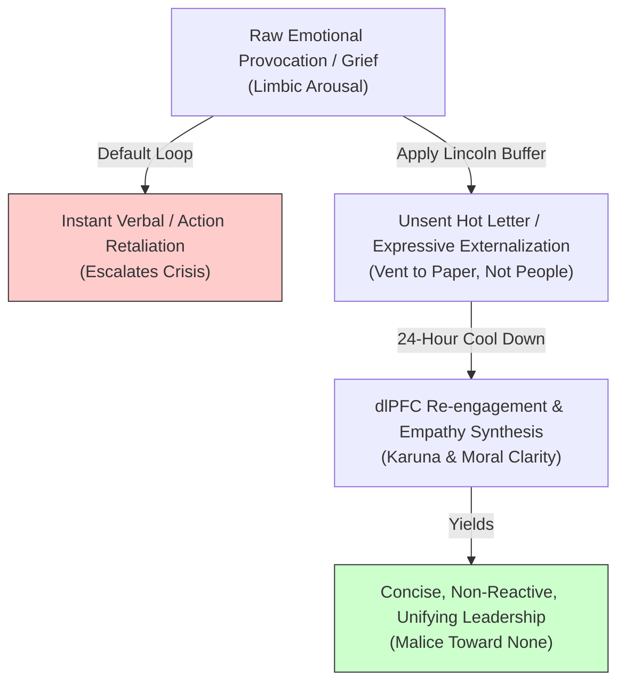

# Abraham Lincoln: Resilience Through Crisis & Rhetorical Leadership

> **Core Insight (TL;DR):** Existential melancholy and severe personal tragedy do not have to lead to psychological collapse; when systematically processed, they can be transmuted into transcendent empathy, moral clarity, and unshakable fortitude. By inserting strict cognitive buffers between emotional impulse and action—epitomized by his famous "unsent hot letter" practice—Abraham Lincoln demonstrated how to master inner turbulence and communicate with unifying, non-reactive precision.

---

## 1. The Surface Struggle vs. The Hidden Mechanism

### The Surface Struggle
When hit by severe personal grief, existential depression, or acute interpersonal provocation, most individuals experience emotional overwhelm or explosive reactivity. They send impulse-driven messages in anger, lash out at adversaries, or retreat into paralyzed despair. When facing intense division or systemic crisis, the instinct is to escalate conflict, demand immediate vengeance, or collapse under the weight of suffering. On the surface, lashing out feels cathartic and justified—it gives an immediate sense of relief and control.

### The Hidden Mechanism
Underneath emotional outbursts and paralyzing grief lie specific neural and cognitive mechanisms:

1. **Limbic Hijack & Impulsive Output:** Provocation fires the amygdala, initiating a fight-or-flight cascade. Without a built-in cognitive buffer, the motor and speech centers execute reactive behavior before the prefrontal cortex can evaluate long-term consequences.
2. **Untransmuted Melancholy (*Tamasic* Sink):** Chronic sorrow or loss, if left unexamined, becomes stagnant. The brain defaults to rumination networks (Default Mode Network), amplifying feelings of helplessness and isolation.
3. **Egoic Retaliation (*Ahamkara* Reactivity):** When insulted or opposed, the ego interprets the event as an existential threat, demanding instant counter-attack to re-establish status, which inevitably deepens external division.

```
   [ REACTIONARY CONFLICT LOOP ]
   Provocation ──> Amygdala Hijack ──> Instant Retaliation (Hot Letter/Outburst) ──> Escalated Division & Regret

   [ LINCOLN'S BUFFER ARCHITECTURE ]
   Provocation ──> Emotional Impulse ──> Unsent Hot Letter (24-Hour Buffer) ──> PFC Processing ──> Concisely Tempered Action
```

---

## 2. The Science & Philosophy Behind It

### Neurobiological Blueprint
* **Dorsolateral PFC Inhibitory Control:** Lincoln’s extraordinary self-restraint relied on robust inhibitory pathways between the dorsolateral prefrontal cortex (dlPFC) and the amygdala. By deliberately delaying his response, he allowed adrenaline levels to decay, switching executive control back to rational deliberation.
* **Insula Activation & Somatic Empathy:** Lincoln suffered from profound clinical melancholy throughout his life. Neurobiologically, processing intense suffering expands insular cortex capacity, enhancing the ability to sense and mirror the internal somatic states of others. Lincoln turned his own deep grief into a mirror for national suffering, cultivating deep empathy (*Karuna*).
* **Vagal Nerve Regulation Through Writing:** Expressive writing acts as a parasympathetic regulator. Writing out anger or grief lowers heart rate variability (HRV) stress markers, discharging limbic arousal onto paper without sending social threat signals to the environment.

### Yogic / Cognitive Perspective
* **Transmutation of *Tamas* into *Sattva*:** In Vedic psychology, depression and heavy sorrow are *Tamasic* (inertia, darkness). Through disciplined moral action (*Tapas*) and self-reflection, Lincoln transmuted *Tamasic* grief directly into *Sattvic* wisdom, balance, and quiet majesty.
* **Mastery of *Manas* via *Buddhi*:** The sensory-emotional mind (*Manas*) reacts instantly to pain or insult with anger. Lincoln trained his higher intellect (*Buddhi*) to hold *Manas* in check, acting as an impartial observer (*Sakshi*) to his own internal storms.
* **Universal Compassion (*Karuna*):** Lincoln’s famous phrase, *"With malice toward none, with charity for all,"* represents the highest realization of non-enmity (*Ahimsa*) and universal compassion. He viewed his political opponents not as evil enemies, but as human beings trapped in conditioning and circumstances.

---

## 3. The Paradigm Shift

Pain and provocation are inevitable; reactivity and bitterness are optional choices. Your emotional intensity must never dictate your output.



### The Core Reframes
1. **Insert a Space Between Stimulus and Response:** The measure of your leadership and character is the duration of the gap between your emotional reaction and your external decision.
2. **Channel Suffering into Empathy:** Do not let grief turn inward into self-pity or outward into bitterness; use your acquaintance with pain to understand the hidden wounds of others.
3. **Speak with Moral Economy:** The Gettysburg Address was only 272 words. True authority does not need loud noise or length; it needs moral clarity and concise truth.

---

## 4. Actionable Protocol & Implementation Guide

### Phase 1: Immediate Micro-Action (Today)
* **The "Unsent Hot Letter" Protocol:**
  1. Whenever you feel intense anger, betrayal, or urge to send a scorching email/text, open a private, offline document (or notebook).
  2. Write out your raw, unfiltered rage without holding back a single insult.
  3. **Rule:** Do NOT put anything in the "To" field. Save/close the document and institute an mandatory **24-hour moratorium**.
  4. After 24 hours, re-read the letter. Notice how your amygdala has cooled. Delete or burn the letter, and draft a cool, concise, professional response.

### Phase 2: Cognitive & Meditative Practice
* **Karuna (Compassion) Transmutation Practice (15 Minutes Daily):**
  1. Sit comfortably, close your eyes, and take slow, deep breaths (4s inhale, 6s exhale).
  2. Bring to mind a recent personal suffering, heartbreak, or disappointment. Feel where it sits in your body.
  3. Expand that feeling outward, realizing: *"Millions of human beings right now feel this exact pain."*
  4. Wish release and peace to all who suffer similarly: *"May we all be free from anger, malice, and grief."*

### Phase 3: Long-Term Habit Calibration
* **The 3-Sentence Moral Economy Rule:**
  * In moments of high-stakes communication or conflict, limit your key message to a maximum of 3 precise sentences. Remove all defensive preamble, self-justification, and emotional padding. Focus purely on principle and shared resolution.

---

## 5. Diagnostic Self-Inquiry

1. *How often do I let raw amygdala arousal dictate my immediate communications, only to spend days managing the fallout?*
2. *Am I using my past pain as an excuse to grow bitter and hostile, or as a lens to cultivate deeper empathy for others?*
3. *If I removed all personal grievances and egoic need for validation from my current conflict, what would the most principled, unifying solution look like?*

---

## 6. Related Concepts & Next Steps in the Wiki

* [Alexithymia: Unlocking Hidden Emotions](file:///C:/Users/Asus/.gemini/antigravity/scratch/healthygamer_knowledge_base/articles/3.2-alexithymia-unlocking-hidden-emotions.md)
* [Anger, Resentment & Suppressed Rage](file:///C:/Users/Asus/.gemini/antigravity/scratch/healthygamer_knowledge_base/articles/3.5-anger-resentment-suppressed-rage.md)
* [Boundaries & Overcoming People Pleasing](file:///C:/Users/Asus/.gemini/antigravity/scratch/healthygamer_knowledge_base/articles/6.4-boundaries-people-pleasing.md)
* [Mahatma Gandhi: Satyagraha & Self-Mastery](file:///C:/Users/Asus/.gemini/antigravity/scratch/healthygamer_knowledge_base/articles_biopics/b1.9-mahatma-gandhi.md)
