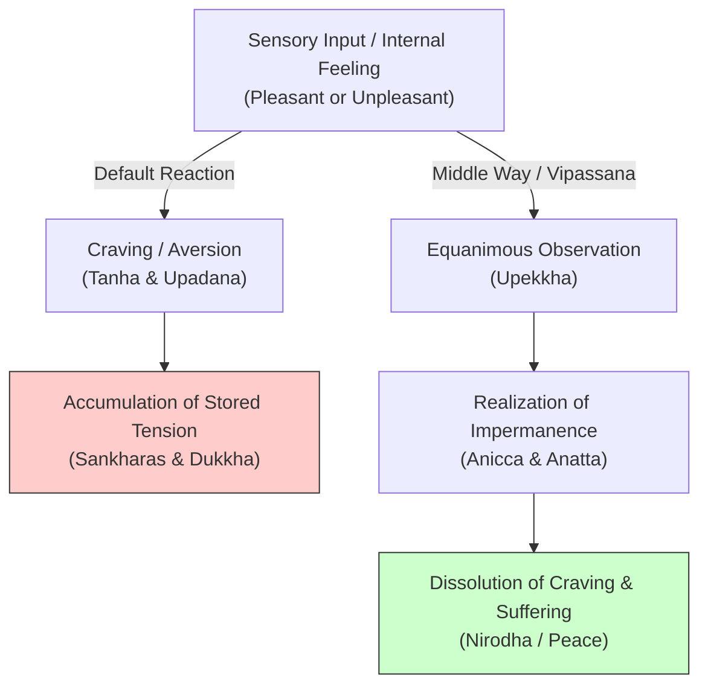

# Gautama Buddha: The Middle Way & Dissolution of Suffering

> **Core Insight (TL;DR):** Suffering (*Dukkha*) does not stem from external circumstances, but from the mind's subconscious craving (*Tanha*) for pleasant sensations and aversion to unpleasant ones. By abandoning the dual extremes of hedonistic sensory gratification and punishing self-mortification, the Middle Way (*Majjhima Patipada*) reveals that all phenomena are impermanent (*Anicca*) and devoid of an immutable self (*Anatta*), systematically liberating the mind from psychological distress.

---

## 1. The Surface Struggle vs. The Hidden Mechanism

### The Surface Struggle
Modern individuals frequently spend their lives swinging wildly between two agonizing extremes:
1. **Hedonistic Indulgence:** Bingeing on high-dopamine triggers (gaming, social media, junk food, substance use) in search of lasting peace, only to experience emptiness, guilt, and addiction.
2. **Ascetic Mortification:** Seeking redemption through extreme, rigid self-punishment, hyper-strict diets, exhausting workaholism, or self-hating discipline, only to burn out and crash back into hedonism.

On the surface, people believe their problem is a lack of willpower, bad luck, or incorrect external conditions. They assume that if they just get the right promotion, partner, or strict routine, suffering will vanish.

### The Hidden Mechanism
Gautama Buddha discovered that both extremes fail because they share the same fundamental cognitive error—clinging (*Upadana*) to temporary sensations:

* **Opponent-Process & Dopamine Dynamics:** Hedonistic indulgence fires dopamine high above baseline. Neurobiologically, the brain compensates by dropping dopamine *below* baseline (dynorphin activation), creating an unpleasant deficit state (craving/pain).
* **The Illusion of Permanence (*Nitya* Bias):** The mind mistakenly treats transient mental states (thoughts, bodily sensations, emotions) as permanent realities, attempting to hold onto pleasant ones and fight unpleasant ones.
* **The Ego Myth (*Anatta* Misunderstanding):** The Default Mode Network constructs a rigid narrative self ("I am suffering", "My life is ruined"). In reality, the self is a dynamic stream of physical and mental constituents (*Skandhas*) changing millisecond by millisecond.

```
   [ THE EXTREMES PENDULUM ]
   Hedonism (Pleasure Pursuit) ──> Dopamine Deficit (Pain/Craving) ──> Mortification (Self-Punishment) ──> Burnout Cycle

   [ THE MIDDLE WAY ARCHITECTURE ]
   Equanimity (Upekkha) ──> Observation of Impermanence (Anicca) ──> De-identification (Anatta) ──> Cessation (Nirodha)
```

---

## 2. The Science & Philosophy Behind It

### Neurobiological Blueprint
* **DMN Down-Regulation via Vipassana:** Deep meditative insight (*Vipassana*) quietens the posteromedial cortex and anterior cingulate nodes of the Default Mode Network (DMN). This shrinks the self-referential narrative loop, disarming the "story of me" that turns physical pain into psychological suffering.
* **Insular-Limbic Decoupling:** Craving activates the insula (somatic discomfort) and ventral striatum. Through mindfulness, the insular interoceptive signal is decoupled from the amygdala and motor outputs. You feel the physical sensation of desire without reacting compulsively to satisfy it.
* **Homeostatic Dopamine Stabilization:** Navigating life via the Middle Way avoids extreme dopamine spikes, preventing severe receptor down-regulation and keeping baseline dopamine optimal for clarity, focus, and quiet contentment.

### Yogic / Cognitive / Buddhist Perspective
* **The Four Noble Truths (*Cattari Ariyasaccani*):**
  1. *Dukkha:* Life contains suffering/unsatisfactoriness.
  2. *Samudaya:* The origin of suffering is craving (*Tanha*) and attachment (*Upadana*).
  3. *Nirodha:* The cessation of suffering is achievable by releasing craving.
  4. *Magga:* The path to liberation is the Noble Eightfold Path.
* **The Three Marks of Existence:**
  * **Anicca (Impermanence):** All sensory, emotional, and physical events arise and pass away continuously.
  * **Anatta (Non-Self):** There is no solid, unchanging identity inside; experience is a flowing river.
  * **Dukkha (Unsatisfactoriness):** Anything impermanent cannot offer permanent satisfaction.
* **Equanimity (*Upekkha*):** Maintaining absolute mental equilibrium toward both pleasant and unpleasant sensations, dissolving stored subconscious reactions (*Sankharas*).

---

## 3. The Paradigm Shift

You do not need to alter the world or torture yourself to find liberation. You only need to stop reacting to the fleeting sensations passing through your mind and body.



### The Core Reframes
1. **Pain is Inevitable; Suffering is Optional:** Pain is the first arrow (physical sensation). Suffering is the second arrow (the mind's emotional reaction to the sensation).
2. **Walk the Middle Way:** Neither indulge every desire nor fight desire with violent self-hatred. Observe desire neutrally as a passing wave.
3. **This Too Shall Pass (*Anicca*):** No feeling, thought, pain, or pleasure is permanent. Your only task is to watch it arise, change, and vanish without clinging.

---

## 4. Actionable Protocol & Implementation Guide

### Phase 1: Immediate Micro-Action (Today)
* **The Craving Interception Pause:**
  1. The moment you feel a intense compulsion (to check your phone, eat junk food, or vent in anger), **STOP** for 90 seconds.
  2. Do not satisfy the urge, and do not scold yourself.
  3. Close your eyes and locate the physical sensation of the craving in your body (e.g., tightness in chest, warmth in stomach, restlessness in fingers).
  4. Silently whisper: *"Anicca, Anicca"* (Impermanent, impermanent). Watch the physical sensation peak and fade.

### Phase 2: Cognitive & Meditative Practice
* **Anapana & Vipassana Body Scan (20 Minutes Daily):**
  1. **Anapana (0-7 min):** Focus undivided attention exclusively on the natural sensation of breath entering and leaving the nostrils. Stills *Chitta Vrittis*.
  2. **Vipassana Scan (7-20 min):** Move attention systematically from head to toe, observing whatever sensations arise (itching, heat, tingling, numbness, pain, cold).
  3. Maintain absolute **Equanimity (*Upekkha*)**: Do not react with pleasure to warm/pleasant sensations, or with irritation to painful ones. Observe every sensation as temporary atomic movement (*Anicca*).

### Phase 3: Long-Term Habit Calibration
* **Middle Way Environmental Audit:**
  * Identify areas where you live in extremes (e.g., 14 hours of work vs. 0 hours; total sugar ban vs. weekend bingeing).
  * Recalibrate each behavior to a sustainable 60-70% middle pathway that requires zero violent willpower or dopamine spikes.

---

## 5. Diagnostic Self-Inquiry

1. *Where in my life am I swinging between extreme hedonistic indulgence and self-punishing mortification?*
2. *When an unpleasant emotion or sensation arises, do I react with automatic aversion, or can I sit with it equanimously for 5 minutes?*
3. *Am I treating my temporary thoughts and feelings as an immutable "Me", or can I see them as passing weather patterns in consciousness?*

---

## 6. Related Concepts & Next Steps in the Wiki

* [Science of Meditation & Mind Types](file:///C:/Users/Asus/.gemini/antigravity/scratch/healthygamer_knowledge_base/articles/4.2-science-of-meditation-mind-types.md)
* [Science of Samskaras: How Past Experiences Form Patterns](file:///C:/Users/Asus/.gemini/antigravity/scratch/healthygamer_knowledge_base/articles/3.1-science-of-samskaras.md)
* [Vasanas & Karma: Escaping Habitual Loops](file:///C:/Users/Asus/.gemini/antigravity/scratch/healthygamer_knowledge_base/articles/4.4-vasanas-karma-habitual-loops.md)
* [Jiddu Krishnamurti: Freedom From the Known](file:///C:/Users/Asus/.gemini/antigravity/scratch/healthygamer_knowledge_base/articles_biopics/b1.14-jiddu-krishnamurti.md)
