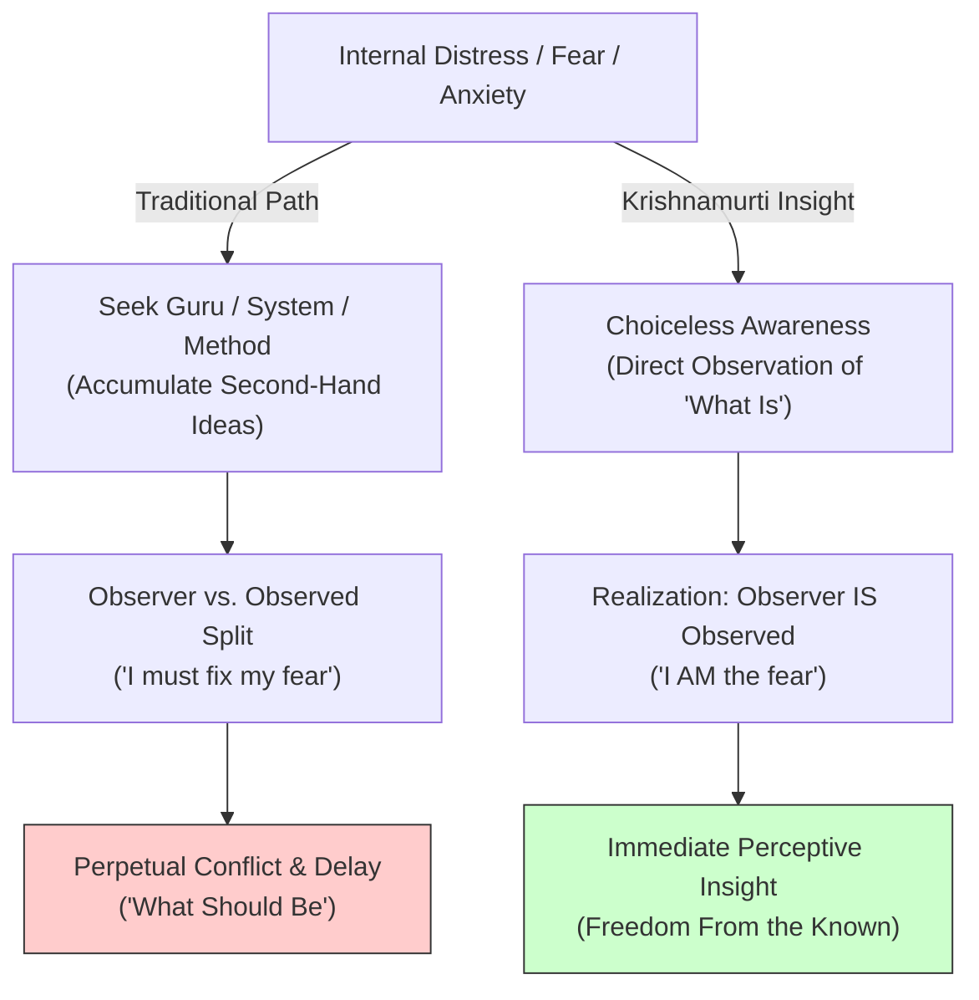

# Jiddu Krishnamurti: Freedom From the Known

> **Core Insight (TL;DR):** Truth cannot be organized, codified, or accessed through external authority, rituals, or second-hand systems; "Truth is a pathless land." Genuine radical transformation occurs only when you dismantle dogmatic conditioning and realize that the seeker is the sought—that "the observer *is* the observed." By observing present reality (*what is*) without judgment or memory-driven projection (*what should be*), immediate perceptive insight liberates the mind from psychological fear.

---

## 1. The Surface Struggle vs. The Hidden Mechanism

### The Surface Struggle
Ambitious seekers and troubled minds constantly search for salvation outside themselves. They consume endless self-help books, join rigid spiritual systems, follow charismatic gurus, or obsessively adhere to complex protocols. Yet despite accumulating vast libraries of intellectual concepts, their fundamental psychological struggles—fear, anxiety, loneliness, anger—remain unchanged. On the surface, following a system feels comforting, structured, and safe. It creates the illusion of spiritual or personal progress.

### The Hidden Mechanism
Jiddu Krishnamurti exposed the profound flaw at the heart of all spiritual and psychological conditioning:

1. **Second-Hand Living & Systemic Addiction:** When you follow a method or a guru, you are living on second-hand knowledge. You accept someone else's realization, which becomes a rigid mental concept in your brain rather than your own direct living perception.
2. **The Dualistic Trap (Observer vs. Observed):** The ego (*Ahamkara*) splits consciousness into two parts: "Me" (the observer, the controller, the thinker) and "My Anger/Fear" (the object being observed). The controller then tries to suppress, change, or cultivate the emotion, creating perpetual internal conflict.
3. **Time as Psychological Escape:** The mind uses time ("I will become peaceful tomorrow through practice") to avoid facing *what is* right now. Desiring *what should be* prevents direct perception of *what is*.

```
   [ TRADITIONAL DOGMATIC/GURU LOOP ]
   Fear/Emptiness ──> Seek External Guru/System ──> Accumulate Concepts ──> Observer vs Observed Split ──> Perpetual Internal Conflict

   [ KRISHNAMURTI'S PATHLESS INSIGHT ]
   Present Experience ──> Choiceless Awareness ──> Observer IS the Observed ──> Instant Dissolution of Conditioning
```

---

## 2. The Science & Philosophy Behind It

### Neurobiological Blueprint
* **DMN Dualism & Predictive Processing:** The Default Mode Network (DMN) constructs the illusion of an independent "center" (the observer) evaluating experience. Predictive coding in the prefrontal cortex overlays past memories (*the known*) onto present sensory inputs, filtering reality through learned expectations rather than direct perception.
* **Choiceless Awareness & Neural De-Filter:** Practice of unconditioned observation (choiceless awareness) inhibits top-down conceptual filtering from the PFC, allowing raw sensory processing in primary sensory cortices and the insula.
* **Instantaneous Amygdala Quelling:** When emotional states (like fear) are observed without conceptual labels or effort to alter them, the amygdala's threat signaling subsides rapidly because the brain stops treating the internal state as an external enemy to fight.

### Radical Advaita / Philosophical Perspective
* **"Truth is a Pathless Land":** In 1929, Krishnamurti famously dissolved the Order of the Star, declaring that truth cannot be approached through any formal religion, sect, or discipline. Truth is found only in the mirror of daily relationship.
* **The Observer is the Observed (*Advaita* Realization):** In non-dual philosophy, the division between subject and object is illusory. You are not *experiencing* anger; you *are* the anger in that moment. When the observer stops trying to control the observed, the dualistic friction collapses.
* **Freedom from *The Known* (*Neti Neti*):** Memory, conditioning, and past experience constitute "the known." True perception can only take place in the present movement of "the unknown."

---

## 3. The Paradigm Shift

Stop seeking systems, methods, and gurus to transform you in the future. Total psychological transformation happens instantaneously when you observe *what is* without the distortion of thought.



### The Core Reframes
1. **No Authority in Matters of Spirit:** Be a light unto yourself. Reject all spiritual authority, systems, and self-appointed gurus.
2. **The Observer IS the Observed:** The thinker is not separate from the thought. You are not a watcher managing anger; you are the living phenomenon of anger itself. When division stops, energy releases.
3. **Die to the Known Every Second:** Carrying accumulated psychological memories into every moment prevents you from ever seeing reality fresh.

---

## 4. Actionable Protocol & Implementation Guide

### Phase 1: Immediate Micro-Action (Today)
* **The Authority Fast & Conditioning Audit:**
  1. Identify one self-help methodology, spiritual guru, or rigid rulebook you currently rely on for self-worth or guidance.
  2. For 24 hours, **suspend reliance on that system entirely**.
  3. Instead of asking *"What does the system say I should do?"*, ask: *"What am I directly observing right now in my own mind and body?"*

### Phase 2: Cognitive & Meditative Practice
* **Choiceless Awareness Sitting (15 Minutes Daily):**
  1. Sit quietly without any meditative technique, mantra, breath control, or goal.
  2. Allow sounds, thoughts, body sensations, and emotions to arise freely.
  3. **Do not name, label, judge, approve, or alter anything.**
  4. Notice the habit of the mind trying to split into a "Watcher" evaluating the experience. Gently observe that very impulse to watch.
  5. Experience the total unity where perception occurs without a perceiver.

### Phase 3: Long-Term Habit Calibration
* **Dissolving "What Should Be" into "What Is":**
  * Whenever you notice psychological conflict (e.g., feeling lonely and wishing you weren't), pause immediately.
  * Stop trying to fix or escape the feeling of loneliness. Look directly at the loneliness itself as a physical and mental fact. When you remain totally present with *what is* without escaping into *what should be*, the conflict vanishes.

---

## 5. Diagnostic Self-Inquiry

1. *Am I living my life through second-hand knowledge and borrowed authority, or through my own direct, unconditioned perception?*
2. *When I feel fear, envy, or anger, am I trying to manage it as an object separate from me, or do I realize that I am that very state?*
3. *How much of my daily mental suffering is caused by escaping present reality ('what is') in favor of an idealized future concept ('what should be')?*

---

## 6. Related Concepts & Next Steps in the Wiki

* [Ahamkara & Imposter Syndrome](file:///C:/Users/Asus/.gemini/antigravity/scratch/healthygamer_knowledge_base/articles/2.2-ahamkara-imposter-syndrome.md)
* [Four Faculties of Mind: Buddhi, Manas, Ahamkara, Chitta](file:///C:/Users/Asus/.gemini/antigravity/scratch/healthygamer_knowledge_base/articles/4.1-four-faculties-of-mind.md)
* [Dissolving the Idealized Self](file:///C:/Users/Asus/.gemini/antigravity/scratch/healthygamer_knowledge_base/articles/2.5-dissolving-idealized-self.md)
* [Gautama Buddha: The Middle Way & Dissolution of Suffering](file:///C:/Users/Asus/.gemini/antigravity/scratch/healthygamer_knowledge_base/articles_biopics/b1.13-gautama-buddha.md)
