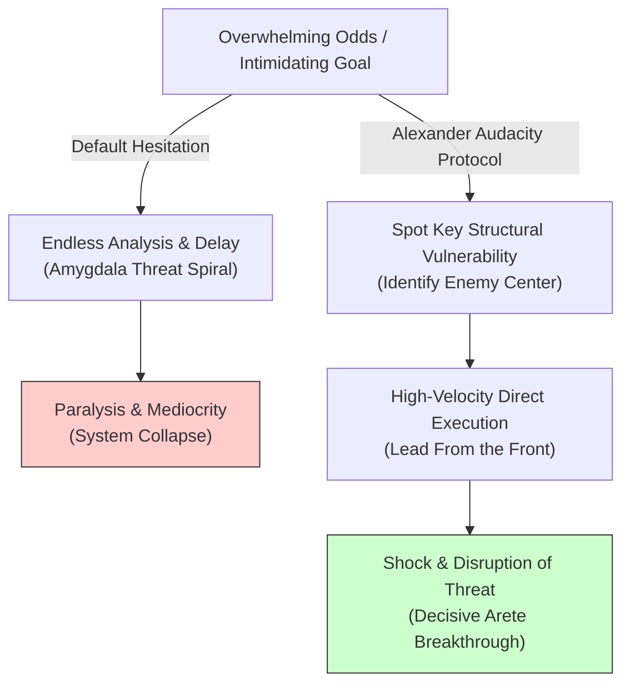

# Alexander the Great: Audacity, Speed & The Cult of Excellence

> **Core Insight (TL;DR):** Hesitation and paralysis in the face of overwhelming odds stem from over-calculating threat scenarios until fear neutralizes agency. Alexander the Great proved that supreme breakthroughs require unyielding audacity (*Audacia*), high-velocity tactical execution, and leading from the front (*Arete*). By charging directly into the enemy's center before they can organize, you turn perceived disadvantages into decisive victories.

---

## 1. The Surface Struggle vs. The Hidden Mechanism

### The Surface Struggle
When confronted with massive projects, intimidating opponents, or daunting life transitions, most people freeze. They over-plan, endlessly analyze risk factors, wait for "ideal conditions," or retreat into comfortable mediocrity. On the surface, this hesitation looks like prudence, caution, and rational risk management. Yet despite endless preparation, the hesitant individual finds themselves perpetually stuck on the sidelines, watching bolder individuals seize opportunities.

### The Hidden Mechanism
Underneath chronic hesitation lies a specific neuro-psychological trap:

1. **Anticipatory Threat Amplification:** The brain’s threat-detection circuitry magnifies potential failure risks exponentially when sitting static. The longer you hesitate before acting, the more time the amygdala has to generate paralyzing scenarios.
2. **Passive Leadership & Distance from Risk:** Hesitant individuals attempt to manage problems from a safe distance. In war and life, leading from behind creates a gap between decision-making and real-time execution, leading to delayed feedback and lost momentum.
3. **The Mediocrity Trap (Absence of *Arete*):** Settling for "good enough" protects the ego (*Ahamkara*) from exposure. Pursuit of heroic excellence (*Arete*) requires risking total public failure in exchange for transcendent breakthrough.

```
   [ THE HESITATION & PARALYSIS LOOP ]
   Daunting Challenge ──> Prolonged Delay/Analysis ──> Amygdala Threat Amplification ──> Paralysis & Mediocrity

   [ ALEXANDER'S AUDACITY ARCHITECTURE ]
   Daunting Challenge ──> Rapid Vulnerability Spotting ──> Instant Front-Line Charge (Wedge Formation) ──> Opponent Shock & Victory
```

---

## 2. The Science & Philosophy Behind It

### Neurobiological Blueprint
* **Dopamine-Noradrenaline Coupling in Rapid Action:** Alexander’s legendary speed relied on coupling noradrenergic arousal (alertness under pressure) with dopaminergic drive (reward anticipation). Fast, decisive physical action suppresses the Default Mode Network’s (DMN) self-doubting rumination, shifting control entirely to the Premotor and Motor Cortices.
* **Locus Coeruleus Optimization:** High-stakes situations flood the brain with catecholamines. While over-arousal causes panic in untrained minds, tactical speed calibrates the locus coeruleus to maintain intense laser focus under chaotic conditions.
* **Overcoming the Freeze Response:** The autonomic nervous system responds to overwhelming odds with fight, flight, or freeze. Audacious action forces the nervous system out of passive freeze into high-agency forward propulsion.

### Yogic / Ancient Greek Perspective
* **Cult of Excellence (*Arete*):** In Ancient Greek philosophy, *Arete* is the relentless pursuit of supreme fulfillment, heroic virtue, and physical/intellectual mastery. Mediocrity was viewed as a spiritual failure.
* **Refining *Rajasic* Energy into Action:** Alexander embodied intense *Rajasic* passion—dynamism, ambition, and fierce drive. In Vedic psychology, *Rajas* can lead to self-destruction if unaligned, but when harnessed with single-pointed focus (*Ekagrata*), it shatters inertia (*Tamas*).
* **Leading from the Front (*Tapas* in Motion):** Alexander personally led the Companion Cavalry at the point of the spear, taking physical wounds alongside his soldiers. This shared hardship (*Tapas*) created an unbreakable psychological bond and transcendent group morale.

---

## 3. The Paradigm Shift

Fortune does not favor the cautious planner who waits for certainty; fortune favors the bold who create certainty through audacity and speed.



### The Core Reframes
1. **Speed Distorts the Opponent’s Decision Loop:** When you move faster than your opponent or environment can process, you create confusion and force them into reactive errors.
2. **Lead From the Point of the Spear:** Never ask your team, your mind, or your body to take a risk you are not personally leading at the absolute front line.
3. **Strike the Center (The Gordian Knot):** When faced with an impossibly tangled problem, do not spend years untying it thread by thread. Take your sword and slice through it with one audacious move.

---

## 4. Actionable Protocol & Implementation Guide

### Phase 1: Immediate Micro-Action (Today)
* **The "Gaugamela 5-Second Blitz":**
  1. Identify one intimidating task or call you have been hesitating to execute for days.
  2. Count down out loud: **5-4-3-2-1**.
  3. On "1", initiate the physical action immediately (send the email, pick up the phone, write the first paragraph) without allowing your PFC to generate objections.

### Phase 2: Cognitive & Meditative Practice
* **High-Arousal Arete Visualization & Box Breathing (12 Minutes Daily):**
  1. Perform **Box Breathing** (4s inhale, 4s hold, 4s exhale, 4s hold) for 4 minutes to achieve physiological composure amidst elevated arousal.
  2. For 8 minutes, visualize yourself stepping into your most daunting current challenge.
  3. Visualize yourself charging directly into the center of the conflict with calm, intense speed, executing with flawless technique (*Arete*), and completely shattering paralysis.

### Phase 3: Long-Term Habit Calibration
* **Front-Line Operational Sovereignty:**
  * Identify any core area in your work or life where you have retreated to "leading from the back" (delegating the hardest emotional work, hiding behind administrative tasks).
  * Re-insert yourself into the highest-friction core activity at least twice a week. Show up at the front lines first.

---

## 5. Diagnostic Self-Inquiry

1. *What monumental opportunity am I currently losing because I am waiting for complete certainty before taking action?*
2. *Where am I hiding behind passive planning and administration instead of leading from the absolute front line of execution?*
3. *If I approached my current biggest obstacle with unyielding audacity and 2x execution speed, how quickly would the obstacle dissolve?*

---

## 6. Related Concepts & Next Steps in the Wiki

* [Tapas: Willpower & Internal Heat](file:///C:/Users/Asus/.gemini/antigravity/scratch/healthygamer_knowledge_base/articles/5.4-tapas-willpower-internal-heat.md)
* [Overcoming Fear of Failure & Fear of Potential](file:///C:/Users/Asus/.gemini/antigravity/scratch/healthygamer_knowledge_base/articles/2.3-fear-of-failure-fear-of-potential.md)
* [Starting When You're Years Behind](file:///C:/Users/Asus/.gemini/antigravity/scratch/healthygamer_knowledge_base/articles/5.2-starting-when-years-behind.md)
* [Sun Tzu: Strategic Adaptability & The Art of Indirect Victory](file:///C:/Users/Asus/.gemini/antigravity/scratch/healthygamer_knowledge_base/articles_biopics/b1.11-sun-tzu.md)
