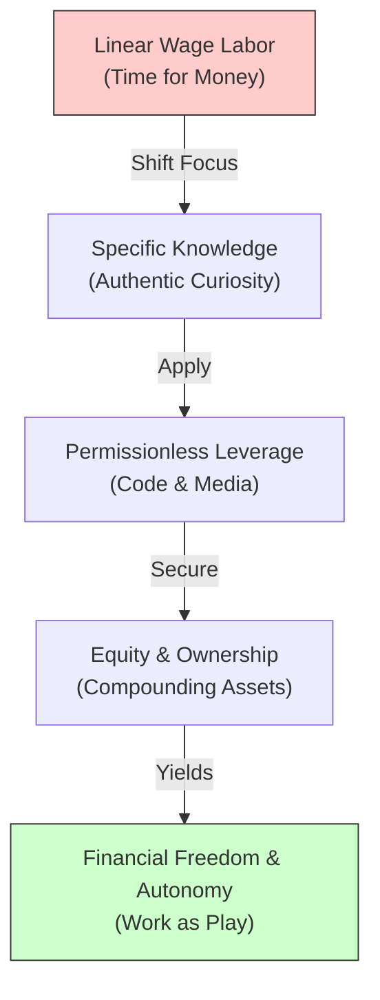

> **Core Insight (TL;DR):** Wealth creation is not an outcome of randomized luck, brute-force linear effort, or wage labor; it is a deterministic skill governed by specific knowledge, leverage, high judgment, and equity ownership. By shifting from selling time to building permissionless assets that compound while you sleep, you decouple financial return from manual labor and achieve true economic freedom.

---

## 1. The Surface Struggle vs. The Hidden Mechanism

### The Surface Struggle
Most ambitious individuals operate under the pervasive cultural illusion that wealth is created by working longer hours, earning degrees, climbing corporate ladders, or getting "lucky." They rent out their time for an hourly rate or annual salary, mistakenly equating productivity with financial accumulation. On the surface, this feels like security: a predictable paycheck, clear hierarchy, and societal approval. However, this creates a persistent, subtle anxiety—the nagging realization that stopping work immediately halts income, leaving them trapped in a linear treadmill where expenses rise alongside earnings (lifestyle creep).

### The Hidden Mechanism
Psychologically and economically, wage labor traps the mind in a zero-sum, linear feedback loop:

1. **Linear Inputs to Linear Outputs:** When you rent your time, your earning capacity is strictly capped by the 24 hours in a day (\(\text{Income} = \text{Hourly Rate} \times \text{Hours Worked}\)). You are trading finite biological existence for linear capital.
2. **Lack of Ownership (Equity):** Without owning equity—a piece of a business, IP, software, or media—you take on downside risk (burnout, lay-offs, inflation) without capturing non-linear upside. The owner of the system captures the exponential surplus of your labor.
3. **Determinism vs. Blind Luck:** People attribute extreme wealth to "Luck Type 1" (blind luck / winning the lottery). In reality, systemic wealth creation relies on "Luck Type 3" (spotting patterns through specific knowledge) and "Luck Type 4" (building an authentic brand and character so unique that luck seeks *you* out).

```
   [ TRADITIONAL WAGE TREADMILL ]
   Time Spent (Linear) ──> Wage Received ──> Expenses ──> Zero Remaining Assets

   [ WEALTH CREATION ARCHITECTURE ]
   Specific Knowledge + Judgment ──> Leverage (Code/Media/Capital) ──> Ownership (Equity) ──> Compounding Assets
```

---

## 2. The Science & Philosophy Behind It

### Neurobiological Blueprint
* **Dopaminergic Habituation & Wage Dependency:** Continuous wage earnings trigger predictable, low-amplitude dopamine drips in the nucleus accumbens. This keeps the prefrontal cortex (PFC) tethered to short-term security cycles while starving the ventral striatum of the novel risk-reward processing needed for entrepreneurial risk-taking.
* **Default Mode Network (DMN) & Status Games:** Selling time forces the brain into social comparison loops (DMN activation), driving status-seeking behavior (buying luxury goods, titles) rather than wealth-seeking behavior (accumulating productive assets). Status is a zero-sum game; wealth is a positive-sum game.
* **Prefrontal Executive Function & Judgment:** High-leverage decision-making requires low baseline cortisol and calm autonomic tone (parasympathetic dominance via the vagus nerve). When the brain is chronically fatigued from long, linear grinding, PFC volume and executive control diminish, causing poor strategic judgment.

### Yogic / Cognitive Perspective
* **Samskara of Labor & Scarcity:** Deeply engrained mental impressions (*samskaras*) from traditional schooling condition the individual to view effort (*tapas*) as a punishment required for survival, rather than authentic, play-like execution (*Svadharma*).
* **Ahamkara (Ego) & Status Traps:** The ego (*Ahamkara*) craves external validation through credentials and titles. Naval’s philosophy aligns with Samkhya and Upanishadic wisdom: true wealth is freedom (*Mukti*) from status games and compulsory labor.
* **Gunas (Rajas vs. Sattva):** Linear grinding is dominated by *Rajasic* energy—restless, frantic, goal-obsessed movement without direction. Wealth creation requires transitioning to *Sattvic* clarity: calm, detached, high-judgment decision-making where small inputs create massive structural outputs.

---

## 3. The Paradigm Shift

To transition from wage labor to autonomous wealth creation, you must fundamentally reframe your understanding of work, luck, and value.



### The Core Reframes
1. **Never Rent Out Your Time:** You will not get rich renting out your time. You must own equity—a piece of a business—to gain your financial freedom.
2. **Arm Yourself with Leverage:** Society will pay you for creating things it wants but does not yet know how to get, at scale. Leverage acts as a force multiplier for your judgment.
3. **Play Iterated Games with Iterated People:** All real returns in life—whether in wealth, relationships, or knowledge—come from compound interest over decades.

---

## 4. Actionable Protocol & Implementation Guide

### Phase 1: Immediate Micro-Action (Today)
* **Equity & Time Audit:** 
  1. Open a blank page and map out your current income sources. Calculate what percentage of your income stops if you take a 6-month break.
  2. Identify 1 asset (a digital product, code repository, written content, or equity stake) that you can start building this week where the reproduction cost is zero.

### Phase 2: Cognitive & Meditative Practice
* **Neti Neti Status Detachment Practice (15 Minutes Daily):**
  1. Sit comfortably, close your eyes, and bring awareness to your breath (slow diaphragmatic breathing, 4s inhale, 6s exhale to activate vagal tone).
  2. Observe thoughts regarding status, job titles, or external approval.
  3. Mentally recite *Neti Neti* ("Not this, not this"): *"I am not my job title. I am not my hourly rate. I am not the status tier assigned to me by society."*
  4. Visualize yourself building permissionless systems that operate independently of your physical presence.

### Phase 3: Long-Term Habit Calibration
* **Weekly Specific Knowledge Sprint:** Block out 5 hours per week (1 hour/day) dedicated exclusively to your natural curiosities—topics you investigate for fun without needing external credentials or monetary compensation.
* **Accountability Staking:** Publicly take accountability for your judgment under your own name. Clear accountability attracts capital, code, and media leverage.

---

## 5. Diagnostic Self-Inquiry

1. *If I stopped trading my physical presence and direct time for money today, what percentage of my income would continue to compound automatically over the next 12 months?*
2. *Am I spending my intellectual energy competing in zero-sum status games (titles, prestige, rankings) or building positive-sum wealth assets?*
3. *What am I doing that feels like play to me, but looks like grueling work to others? How can I wrap leverage around that unique capability?*

---

## 6. Related Concepts & Next Steps in the Wiki

* [Productize Yourself: Authenticity & Leverage](file:///C:/Users/Asus/.gemini/antigravity/scratch/healthygamer_knowledge_base/articles_naval/n1.2-productize-yourself.md) — Learn how to merge your unique identity with scalable systems.
* [The Four Forms of Leverage: Labor, Capital, Code & Media](file:///C:/Users/Asus/.gemini/antigravity/scratch/healthygamer_knowledge_base/articles_naval/n1.3-four-forms-of-leverage.md) — Deep dive into asymmetric leverage engines.
* [Specific Knowledge & Authentic Play](file:///C:/Users/Asus/.gemini/antigravity/scratch/healthygamer_knowledge_base/articles_naval/n1.4-specific-knowledge-authentic-play.md) — Discover your unteachable instincts and curiosity edge.
* [Judgment, Decision-Making & Compounding](file:///C:/Users/Asus/.gemini/antigravity/scratch/healthygamer_knowledge_base/articles_naval/n1.5-judgment-compounding.md) — Master high-leverage mental models for compounding returns.
