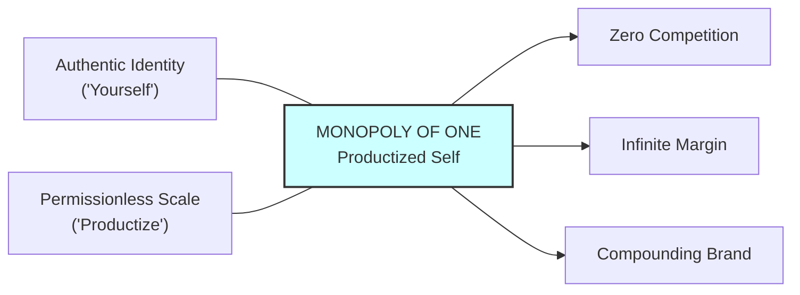

> **Core Insight (TL;DR):** "Productize Yourself" is the dual formula for ultimate career leverage: "Yourself" represents authenticity, specific knowledge, and uncopyable personal obsession; "Productize" represents wrapping that authenticity in permissionless technology (code, media, systems). By converting your unique psychological stack into a scalable product, you escape competition through hyper-differentiation and build a "Monopoly of One."

---

## 1. The Surface Struggle vs. The Hidden Mechanism

### The Surface Struggle
Most professionals and entrepreneurs spend their lives attempting to fit into pre-existing market slots. They look around at successful incumbents, copy their strategies, adopt their jargon, and compete head-to-head on pricing or extra hours. This leads to profound existential exhaustion, commoditization, and severe burnout. When you compete by imitating others, you enter a race to the bottom where margin, pricing power, and personal fulfillment vanish.

### The Hidden Mechanism
The fundamental problem with imitation is that it ignores the law of competitive advantage and human neuro-individuality:

1. **The Mimetic Trap:** Human desires and career paths are largely mimetic (as formulated by René Girard). We copy what others value to gain social proof. But in economic terms, if anyone can be trained to do what you do via a standardized curriculum, anyone can replace you for cheaper.
2. **The High Cost of Non-Authenticity:** Masking your natural curiosities to perform standard corporate roles creates continuous cognitive dissonance. Maintaining an unauthentic professional persona consumes immense PFC capacity, leaving fewer executive resources for creative problem-solving and strategic judgment.
3. **The Solution — Monopoly of One:** Naval Ravikant encapsulates this principle: *"Productize yourself."* 
   * **"Yourself"** has authenticity. No one can compete with you on being you.
   * **"Productize"** has leverage. Turning your unique insights into software, content, media, or proprietary systems allows your output to scale infinitely at zero marginal cost.

```
   [ THE MIMETIC TRAP ]
   Imitate Competitors ──> Commoditization ──> Price War / Burnout ──> Replaceability

   [ PRODUCTIZE YOURSELF ]
   Authentic Obsessions ("Yourself") × Permissionless Leverage ("Productize") ──> Monopoly of One
```

---

## 2. The Science & Philosophy Behind It

### Neurobiological Blueprint
* **Neuro-Architectural Uniqueness:** Each human brain possesses a distinct synaptic wiring blueprint shaped by genetic predisposition and early developmental experiences. When you work against this natural architecture, neural processing is inefficient. When you work in alignment with it, flow states (characterized by synchronized theta and gamma oscillations in the PFC) occur effortlessly, maximizing output while minimizing mental exhaustion.
* **Intrinsically Driven Dopaminergic Circuits:** Extrinsic motivators (money, status) rely on transient ventral striatal dopamine spikes that quickly habituate, leading to burnout. Intrinsic curiosity activates sustained mesolimbic dopamine pathways, producing relentless energy and effortless focus.
* **Cognitive Load & Authentication:** Expressing authentic specific knowledge reduces baseline activity in the anterior cingulate cortex (ACC), which otherwise monitors social threat and mask-maintenance. Authentication lowers anxiety and frees bandwidth for innovation.

### Yogic / Cognitive Perspective
* **Svadharma vs. Paradharma (Bhagavad Gita):** The *Bhagavad Gita* states: *"It is far better to perform one's own duty (Svadharma), even if flawed, than to master another's duty (Paradharma)."* Copying others is *Paradharma*, which creates inner friction (*kleshas*) and spiritual suffering. "Yourself" is the realization of *Svadharma*.
* **Unique Samskaras as Economic Moats:** Your past experiences, unique eccentricities, specific struggles, and niche interests form a distinct bundle of *Samskaras* (latent impressions). When synthesized with modern technology, these *samskaras* become an uncopyable economic moat.
* **Ahamkara & Differentiation:** Transforming the ego (*Ahamkara*) from a status-seeking vehicle into an authentic vehicle of service allows one to build a monopoly without fear of rejection or failure.

---

## 3. The Paradigm Shift

You must stop asking "What business should I start?" or "What job pays the most?" and instead ask "What am I uniquely wired to do that feels like play to me, and how can I package it into a product?"



### Key Pillars of the Paradigm Shift
1. **Escape Competition Through Authenticity:** No one can compete with you on being you. If you build an enterprise around your authentic self, you have no true rivals.
2. **Turn Knowledge into Capital:** Raw knowledge inside your head is unscalable. Wrapped in code, written blueprints, media, or automated services, it becomes leverageable capital.
3. **Build a Personal Brand of Trust:** In an age of AI-generated commodity content, authenticity and accountability under your real name become the ultimate trust signal.

---

## 4. Actionable Protocol & Implementation Guide

### Phase 1: Immediate Micro-Action (Today)
* **The "Intersection Matrix" Inventory:** Take out a notebook and write down 3 distinct domains where you have deep curiosity or experience (e.g., *Biochemistry + Gaming + System Architecture*). Identify the unique intersection where these 3 domains overlap. This triple-intersection is your candidate for "Yourself."

### Phase 2: Cognitive & Meditative Practice
* **Svadharma Unmasking Meditation (20 Minutes Daily):**
  1. Sit in a comfortable meditative posture, focusing on the heart center (*Anahata Chakra*).
  2. Inhale deeply for 4 counts, hold for 4 counts, exhale for 6 counts.
  3. Ask yourself: *"If all social status, money, and parental/peer approval were completely removed from the world, what problems would I still solve for pure joy?"*
  4. Allow responses to surface without PFC censorship. Record all insights immediately post-session.

### Phase 3: Long-Term Habit Calibration
* **The "Productization" Engine:**
  * **Step 1 (Extract):** Document your personal workflows, frameworks, and unique problem-solving methodologies into written guides or code modules.
  * **Step 2 (Package):** Convert these assets into media (videos, essays, podcasts) or software (apps, tools, scripts) that can be distributed at zero marginal cost.
  * **Step 3 (Distribute):** Publish consistently to build permissionless reach and trust.

---

## 5. Diagnostic Self-Inquiry

1. *Am I spending my time competing in an established market by imitating existing leaders, or am I building a unique category where I am the sole practitioner?*
2. *If someone offered to pay me 2x my current income to copy a competitor's system for 5 years, would accepting that destroy my long-term authentic leverage?*
3. *What part of my work can be easily automated by software or delegated to someone else, and what part requires my unique, unteachable judgment?*

---

## 6. Related Concepts & Next Steps in the Wiki

* [How to Get Rich Without Getting Lucky](file:///C:/Users/Asus/.gemini/antigravity/scratch/healthygamer_knowledge_base/articles_naval/n1.1-how-to-get-rich.md) — The foundational framework of non-linear wealth creation.
* [The Four Forms of Leverage: Labor, Capital, Code & Media](file:///C:/Users/Asus/.gemini/antigravity/scratch/healthygamer_knowledge_base/articles_naval/n1.3-four-forms-of-leverage.md) — How to apply code and media to productize your insights.
* [Specific Knowledge & Authentic Play](file:///C:/Users/Asus/.gemini/antigravity/scratch/healthygamer_knowledge_base/articles_naval/n1.4-specific-knowledge-authentic-play.md) — How to uncover your unteachable, play-like capabilities.
* [Judgment, Decision-Making & Compounding](file:///C:/Users/Asus/.gemini/antigravity/scratch/healthygamer_knowledge_base/articles_naval/n1.5-judgment-compounding.md) — Making high-leverage decisions to scale your productized self.
