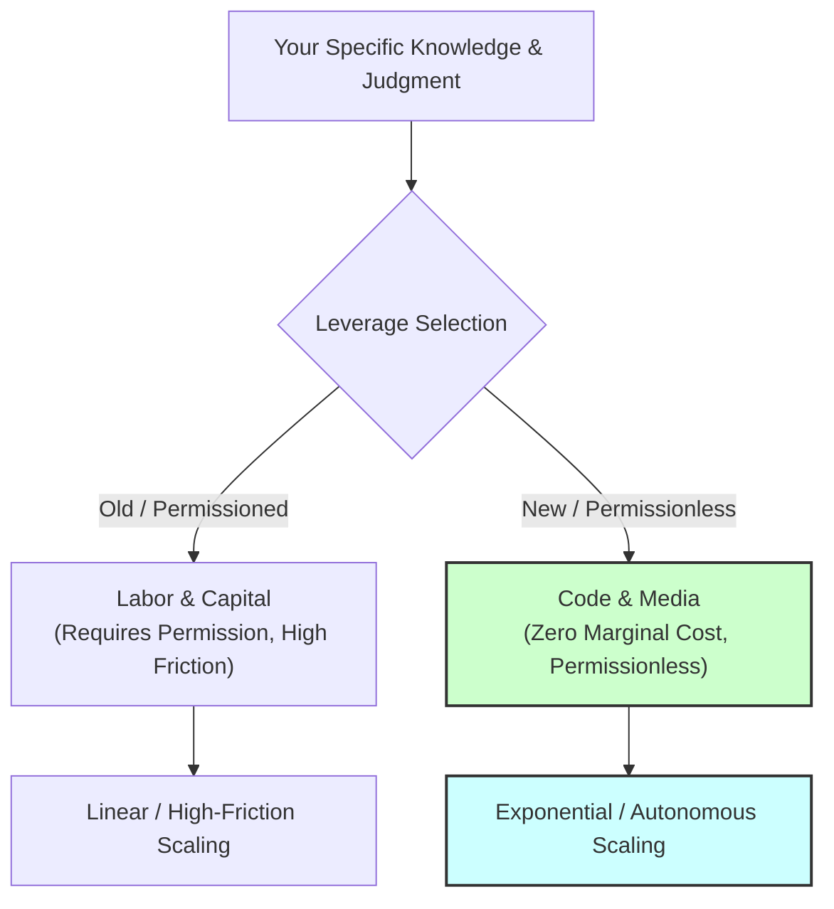

> **Core Insight (TL;DR):** Leverage is the ultimate force multiplier that decouples physical effort from economic output. While traditional forms of leverage (labor and capital) require permission, management overhead, and high friction, modern forms of leverage (code and media) are completely permissionless, operating at zero marginal cost of replication to grant individual practitioners massive asymmetric upside.

---

## 1. The Surface Struggle vs. The Hidden Mechanism

### The Surface Struggle
Many workers fall into the trap of believing that the path to higher income is simply working harder, putting in 80-hour workweeks, or managing larger teams of people. They experience chronic physical and emotional exhaustion, yet their financial trajectory remains frustratingly linear. When they attempt to scale, they encounter immense operational friction: managing employees leads to relational stress, and raising capital requires begging investors and giving up autonomy.

### The Hidden Mechanism
The fundamental difference lies in understanding the taxonomy of leverage and permission:

1. **Permissioned vs. Permissionless Leverage:**
   * **Labor (People working for you):** The oldest form of leverage. Requires permission to manage, carries heavy emotional/relational overhead, and creates complex organizational politics.
   * **Capital (Money working for you):** Modern industrial leverage. Highly effective, but requires permission from bankers, investors, or asset markets to access at scale.
   * **Code & Media (Software, algorithms, podcasts, essays, videos):** The newest form of leverage. Completely **permissionless**. You do not need anyone's approval to write a script, host a podcast, or publish an article.
2. **Zero Marginal Cost of Replication:** Software and digital media cost zero dollars to replicate once built. A piece of code runs millions of times; a podcast episode streams to millions of listeners while you sleep.
3. **Asymmetric Upside:** Permissionless leverage creates asymmetric risk profiles where your downside is capped (time invested) and your upside is theoretically unbounded.

```
                  ┌──────────────────────────────────────────────────────────┐
                  │                 TAXONOMY OF LEVERAGE                     │
                  └──────────────────────────────────────────────────────────┘
                                        │
           ┌────────────────────────────┴────────────────────────────┐
           ▼                                                         ▼
 [ PERMISSIONED LEVERAGE ]                                 [ PERMISSIONLESS LEVERAGE ]
  Requires human consent                                    Requires zero consent
  • Labor (Managing people)                                 • Code (Software, AI, Bots)
  • Capital (Money, debt, equity)                           • Media (Podcasts, writing, video)
  High friction & management overhead                       Zero marginal cost of replication
```

---

## 2. The Science & Philosophy Behind It

### Neurobiological Blueprint
* **Allostatic Load & Management Stress:** Managing large groups of people (labor leverage) chronically activates the sympathetic nervous system and the Hypothalamic-Pituitary-Adrenal (HPA) axis, elevating cortisol and baseline inflammatory markers. In contrast, building permissionless code/media leverage allows the nervous system to remain in parasympathetic balance.
* **Cognitive Reserve & Force Multiplication:** When an individual utilizes code or media, software acts as an externalized prefrontal cortex extension. Algorithms execute logical rules perfectly without consuming cognitive reserve or metabolic glucose, preserving PFC capacity for strategic decision-making and creative insight.
* **Dopaminergic Asymmetry:** Linear labor creates a 1:1 reward structure that extinguishes intrinsic motivation over time. Permissionless leverage introduces non-linear reward distributions, activating robust dopamine bursts when media or software scales unexpectedly (viral feedback loops).

### Yogic / Cognitive Perspective
* **Tapas (Disciplined Effort) Directed Efficiently:** In Samkhya philosophy, *Tapas* represents transformative heat or energy. Expending *Tapas* on manual labor without leverage is like burning wood in an open field—most heat dissipates. Applying *Tapas* to code and media is like focusing light through a magnifying glass, concentrating effort for exponential output.
* **Detachment from Ownership of Labor (Karma Yoga):** The *Bhagavad Gita* advocates working without attachment to outcomes (*Karmanye Vadhikaraste*). Permissionless leverage embodies Karma Yoga: you build the code or record the media once with full devotion, release it into the world, and let the network compound without emotional attachment to immediate linear returns.
* **Gunas of Systems:** Labor leverage often introduces *Rajasic* turmoil (conflict, politics). Media and code, when structured thoughtfully, create a *Sattvic* system—harmonious, silent, orderly, and autonomous.

---

## 3. The Paradigm Shift

Shift your focus from "How many hours can I work?" to "What leverage engines can I build that will work on my behalf 24/7/365?"



### Comparative Leverage Breakdown
| Feature | Labor Leverage | Capital Leverage | Code & Media Leverage |
| :--- | :--- | :--- | :--- |
| **Permission Needed?** | Yes (Hiring, managing) | Yes (Investors, banks) | **No (Permissionless)** |
| **Marginal Cost** | High (Salaries, benefits) | High (Interest, dilution) | **Zero ($0 to replicate)** |
| **Friction Level** | High (Human conflicts) | Moderate (Compliance) | **Ultra-Low (Autonomous)** |
| **Scale Potential** | Limited by org structure | Limited by available fund | **Infinite (Global internet)** |

---

## 4. Actionable Protocol & Implementation Guide

### Phase 1: Immediate Micro-Action (Today)
* **Leverage Classification Audit:** Look at your current weekly schedule. Categorize your outputs into:
  1. *Zero-leverage tasks* (manual emails, linear meetings).
  2. *Low-leverage tasks* (manual reports).
  3. *High-leverage permissionless assets* (code written, content published, automation scripts created).
  *Identify 1 task in category 1 or 2 that can be replaced by an automated script, software tool, or written SOP today.*

### Phase 2: Cognitive & Meditative Practice
* **The "Force Multiplier" Visualization (15 Minutes Daily):**
  1. Sit quietly with spine erect. Take 5 deep pranayama cycles (Box Breathing: 4s in, 4s hold, 4s out, 4s hold).
  2. Visualize your mind as an architect standing above a city of automated engines.
  3. Contemplate the distinction between physical labor (*Kriya*) and system architecture (*Sankalpa*).
  4. Anchor the feeling of detachment: *"My code and media work while I sleep; my physical body rests in calm awareness."*

### Phase 3: Long-Term Habit Calibration
* **Build a Permissionless Media/Code Stack:**
  * **Daily Habit:** Spend 90 minutes every morning before opening email writing code, building digital products, or creating long-form educational media.
  * **Systemization:** Never perform a manual process more than 3 times without writing a script, recorded walkthrough, or automated pipeline for it.

---

## 5. Diagnostic Self-Inquiry

1. *What percentage of my daily economic production relies on my physical presence versus automated systems (code, media, capital)?*
2. *If I wanted to reach 100,000 people tomorrow with my solution, whose permission would I need to ask? (If the answer is 'nobody', you own permissionless leverage).*
3. *Am I spending more time managing human complexity (labor leverage) than constructing automated media/code assets?*

---

## 6. Related Concepts & Next Steps in the Wiki

* [How to Get Rich Without Getting Lucky](file:///C:/Users/Asus/.gemini/antigravity/scratch/healthygamer_knowledge_base/articles_naval/n1.1-how-to-get-rich.md) — The master thesis of permissionless wealth generation.
* [Productize Yourself: Authenticity & Leverage](file:///C:/Users/Asus/.gemini/antigravity/scratch/healthygamer_knowledge_base/articles_naval/n1.2-productize-yourself.md) — Wrapping your unique identity inside code and media.
* [Specific Knowledge & Authentic Play](file:///C:/Users/Asus/.gemini/antigravity/scratch/healthygamer_knowledge_base/articles_naval/n1.4-specific-knowledge-authentic-play.md) — Identifying the content and problems to apply leverage to.
* [Judgment, Decision-Making & Compounding](file:///C:/Users/Asus/.gemini/antigravity/scratch/healthygamer_knowledge_base/articles_naval/n1.5-judgment-compounding.md) — Applying high judgment to direct massive leverage engines.
