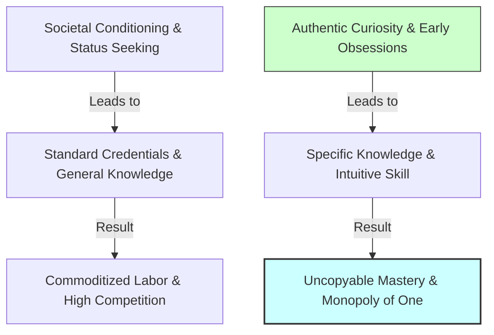

> **Core Insight (TL;DR):** Specific knowledge is knowledge that cannot be taught in a school, textbook, or bootcamp—if it can be easily taught, it can be easily replaced by another human or an algorithm. It is discovered by pursuing your genuine obsessive curiosity, natural talents, and authentic play, resulting in expertise that feels effortless to you but looks like grueling labor to everyone else.

---

## 1. The Surface Struggle vs. The Hidden Mechanism

### The Surface Struggle
Society trains individuals to seek out "safe," standardized, highly credentialed career paths—such as pursuing degrees, certifications, and traditional industry playbooks purely for social status and job security. People spend years studying subjects they find boring, grinding through resume-building exercises, and forcing themselves into rigid professional boxes. The result is chronic imposter syndrome, psychological apathy, and intense vulnerability: because their skills were acquired through a standardized curriculum, they face fierce competition from thousands of identical credential-holders.

### The Hidden Mechanism
 naval’s distinction between *general knowledge* (credentialism) and *specific knowledge* reveals why traditional career pathing fails in the modern economy:

1. **Unteachable Instincts:** Specific knowledge is found by following your genuine intellectual obsessions rather than whatever is currently hot in the job market. It is highly intuitive, contextual, and deeply aligned with your core psychology.
2. **"Play to You, Work to Others":** Because specific knowledge aligns with your natural wiring, engaging in it feels like play. You can spend 16 hours a day tinkering, reading, or coding without exerting willpower, while a competitor relying purely on discipline burns out in 2 hours.
3. **Impossibility of Outsourcing:** If society can train someone else to do your job via a step-by-step manual, it will eventually train someone younger, cheaper, or an AI agent to replace you. Specific knowledge is learned on the job through apprenticeship, trial, and authentic curiosity.

```
   [ THE CREDENTIALIST TRAP ]
   Standardized Curriculum ──> Standardized Skills ──> High Competition ──> High Vulnerability

   [ SPECIFIC KNOWLEDGE ENGINE ]
   Genuine Obsessive Curiosity ──> Unteachable Intuition ──> Authentic Play ──> Uncopyable Mastery
```

---

## 2. The Science & Philosophy Behind It

### Neurobiological Blueprint
* **Intrinsic Motivation & Dopaminergic Persistence:** When learning is driven by external rewards (grades, credentials), it relies on short-term extrinsic reward circuits. Specific knowledge taps into long-term intrinsic dopaminergic pathways (VTA to nucleus accumbens and PFC). This neurochemical alignment induces *Hyperfocus* and *Flow States*, where brain activity reorganizes into synchronized theta-gamma coupling, enabling rapid skill acquisition without cognitive fatigue.
* **Neuroplasticity via Emotional Resonance:** The brain's neuroplastic adaptation (synaptic strengthening via long-term potentiation) is dramatically accelerated when emotional resonance and curiosity are present. Information learned through passionate play is consolidated far deeper into long-term memory than rote-memorized coursework.
* **Reduction of Inhibitory PFC Friction:** Forcing oneself to study boring material requires immense prefrontal inhibitory control, draining blood glucose and mental reserve. Authentic play bypasses this inhibitory friction, allowing smooth, continuous neural execution.

### Yogic / Cognitive Perspective
* **Svadharma & Svabhava (Inner Nature):** In Indian philosophy, *Svabhava* is one's innate disposition or essential nature, while *Svadharma* is the life path aligned with that disposition. Pursuing specific knowledge is the direct realization of *Svabhava*. Trying to force yourself into a high-status field that contradicts your *Svabhava* generates severe internal friction (*Vikarma*).
* **Samskaras of Childhood Play:** Specific knowledge often reveals itself early in life—in the hobbies, games, and topics you obsessively pursued between ages 7 and 14 before societal conditioning (*samskaras*) forced you into status-seeking.
* **Chitta Vrittis & Mental Quietude:** Grinding through unrewarding work creates constant mental agitation (*Chitta Vrittis*). Engaging in authentic play calms the mind, producing a *Sattvic* state of immersion where work becomes a form of active meditation (*Karma Yoga*).

---

## 3. The Paradigm Shift

You must stop pursuing credentials to impress others and start cultivating your authentic curiosities to build uncopyable mastery.



### Key Mindset Principles
1. **Don't Study What Is 'Hot':** By the time a skill is packaged into a university degree or bootcamp, it is already becoming commoditized. Follow your weird, hyper-niche interests.
2. **Work Should Feel Like Play:** If your work feels like a grueling chore, you will inevitably be outperformed by someone who finds it genuinely thrilling.
3. **Embrace Your Eccentricities:** Your unique combination of passions, oddities, and hyper-fixations is not a flaw—it is the blueprint for your economic moat.

---

## 4. Actionable Protocol & Implementation Guide

### Phase 1: Immediate Micro-Action (Today)
* **Childhood Obsession Audit:** 
  1. Write down 3 activities, topics, or games you were obsessively interested in between ages 7 and 14 (e.g., *analyzing game mechanics, organizing sports stats, building custom PC hardware, writing fan fiction*).
  2. Map out how these early obsessions translate into modern digital capabilities (e.g., *data analysis, system optimization, digital storytelling*).

### Phase 2: Cognitive & Meditative Practice
* **Svabhava Inquiry Meditation (15 Minutes Daily):**
  1. Sit comfortably in meditation, closing your eyes and settling your breath.
  2. Ask yourself silently: *"What is a topic I would research for 3 hours tonight even if I were guaranteed never to make a single dollar from it?"*
  3. Notice where in your body you feel expansion (excitement/curiosity) vs. contraction (duty/status-seeking).
  4. Journal all unedited thoughts immediately following the meditation session.

### Phase 3: Long-Term Habit Calibration
* **Permissionless Curiosity Sprints:** Allocate 4 hours every weekend to explore a hyper-niche interest without any goal of monetization, credentialing, or public display. Let pure intrinsic curiosity guide your reading, coding, or building.
* **Apprenticeship over Schooling:** Seek out practitioners who are at the cutting edge of your specific interest. Work for them, collaborate with them, or build open-source tools for them to learn unteachable, contextual instincts.

---

## 5. Diagnostic Self-Inquiry

1. *If all degrees, certificates, and job titles were erased from the world, what skills would I still possess that others could not replicate?*
2. *Is my current primary work driven by intrinsic curiosity (feels like play), or by extrinsic status/fear of losing security?*
3. *What is something I find effortless and enjoyable that my peers constantly complain about as being difficult or tedious?*

---

## 6. Related Concepts & Next Steps in the Wiki

* [How to Get Rich Without Getting Lucky](file:///C:/Users/Asus/.gemini/antigravity/scratch/healthygamer_knowledge_base/articles_naval/n1.1-how-to-get-rich.md) — The core framework for converting specific knowledge into wealth.
* [Productize Yourself: Authenticity & Leverage](file:///C:/Users/Asus/.gemini/antigravity/scratch/healthygamer_knowledge_base/articles_naval/n1.2-productize-yourself.md) — Packaging your specific knowledge into scalable products.
* [The Four Forms of Leverage: Labor, Capital, Code & Media](file:///C:/Users/Asus/.gemini/antigravity/scratch/healthygamer_knowledge_base/articles_naval/n1.3-four-forms-of-leverage.md) — Applying code and media to multiply the impact of your specific knowledge.
* [Judgment, Decision-Making & Compounding](file:///C:/Users/Asus/.gemini/antigravity/scratch/healthygamer_knowledge_base/articles_naval/n1.5-judgment-compounding.md) — Scaling specific knowledge through high-leverage decision-making.
