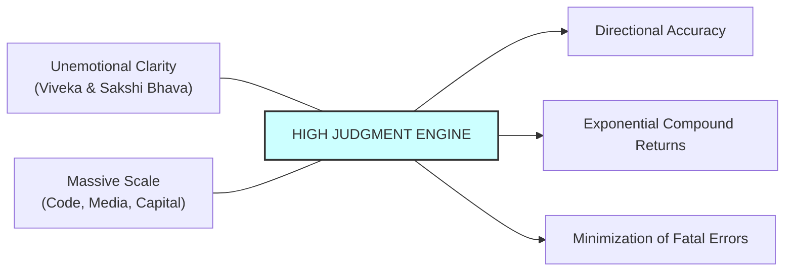

> **Core Insight (TL;DR):** In an age of infinite leverage, your economic output is not determined by how hard you work, but by the quality of your judgment and direction. A single high-judgment decision backed by massive leverage (code, capital, media) can create multi-million dollar outcomes, while frantic low-judgment activity merely leads to burn-out and compounding mistakes.

---

## 1. The Surface Struggle vs. The Hidden Mechanism

### The Surface Struggle
Many professionals conflate physical motion with progress. They fill their calendars with back-to-back meetings, respond to instant messages within seconds, and pride themselves on working 14-hour days. Yet despite their frantic activity, their key career and business metrics remain stagnant. They fall into the "busywork trap"—micro-managing trivial details while repeatedly making catastrophic, high-consequence strategic mistakes regarding positioning, capitalization, or partner selection.

### The Hidden Mechanism
The economic impact of effort changes fundamentally as leverage increases:

1. **Leverage Multiplies Judgment (Good or Bad):**
   * Without leverage: A bad decision hurts only your direct output.
   * With massive leverage: A bad decision multiplies across thousands of servers, millions of dollars, or millions of users. 
   * **Formula:** \(\text{Economic Value} = \text{Leverage} \times \text{Judgment}\).
2. **Direction Over Speed:** Running fast in the wrong direction is worse than standing still. Judgment is knowing which direction to run.
3. **Compounding Requires Radical Clarity:** Exceptional judgment requires an unemotional, objective view of reality. Most people make poor decisions because their perception is clouded by wishful thinking, ego defense, anger, or social peer pressure.

```
   [ THE BUSYWORK TRAP (Low Judgment, Low Leverage) ]
   Frantic Activity ──> Exhaustion ──> Poor Strategic Choices ──> Linear / Negative Returns

   [ THE HIGH-LEVERAGE JUDGMENT ENGINE ]
   Clear Mind / Calm PFC ──> High Judgment (Direction) × Massive Leverage ──> Exponential Compounding
```

---

## 2. The Science & Philosophy Behind It

### Neurobiological Blueprint
* **PFC Executive Control & Emotional Regulation:** High-quality judgment relies on the Dorsolateral Prefrontal Cortex (dlPFC) maintaining top-down control over the limbic system (amygdala). When chronic stress or sleep deprivation elevates baseline cortisol, PFC function degrades, forcing the brain into reactive, emotional decision-making (amygdala hijack).
* **Insular Cortex & Somatosensory Intuition:** Superior judgment is not merely cold logic; it integrates bodily somatic markers (gut feeling) via the anterior insular cortex. Top decision-makers possess high interoceptive awareness, picking up subtle pattern-recognition signals before they consciously register.
* **Brain-Derived Neurotrophic Factor (BDNF) & Compounding:** Long-term cognitive clarity requires neural plasticity. Physical rest, meditation, and low baseline stress increase BDNF, allowing the brain to update mental models when presented with disconfirming evidence.

### Yogic / Cognitive Perspective
* **Viveka (Discernment):** In Vedantic philosophy, *Viveka* is the intellectual capacity to discriminate between the real (*Sat*) and the unreal (*Asat*), the essential and the non-essential. Judgment is *Viveka* applied to business, technology, and life decisions.
* **Chitta Vrittis & Mental Distortion:** The *Yoga Sutras* define yoga as the cessation of mental fluctuations (*Yogas Chitta Vritti Nirodha*). A calm mind acts like clear water; a turbulent mind acts like muddy water. You cannot make high-judgment decisions when your mind is muddy with anxiety, greed, or anger.
* **Sakshi Bhava (The Witness State):** To make unemotional decisions, one must cultivate *Sakshi Bhava*—the ability to observe your thoughts, biases, and ego desires from a detached distance without identifying with them.

---

## 3. The Paradigm Shift

Shift from valuing "hours worked" to valuing "calm clarity, high judgment, and compounding decision quality."



### Core Principles of Judgment & Compounding
1. **Clear Thinking Over Hard Work:** A worker who thinks clearly for 2 hours and makes 1 perfect strategic decision outperforms a frantic worker who works 12 hours making mediocre decisions.
2. **Empty Your Calendar:** You cannot cultivate high judgment if your days are packed with reactive meetings. High judgment requires large blocks of unstructured time for reading, thinking, and reflection.
3. **Compound Interest in All Things:** Play long-term games with long-term people. Reputation, relationships, capital, and expertise all compound exponentially over decades if you avoid short-term ethical or strategic compromises.

---

## 4. Actionable Protocol & Implementation Guide

### Phase 1: Immediate Micro-Action (Today)
* **Calendar Decluttering Audit:** 
  1. Open your calendar for next week. Identify at least 3 recurring, low-leverage meetings or low-impact commitments.
  2. Cancel, delegate, or convert them into asynchronous text updates. Reclaim at least 3 continuous hours of uninterrupted "thinking time."

### Phase 2: Cognitive & Meditative Practice
* **Chitta Vritti Quietude & Decision Meditation (20 Minutes Daily):**
  1. Sit comfortably with back straight. Begin with 5 minutes of *Nadi Shodhana* (alternate nostril breathing) to balance left/right brain hemispheres and calm the autonomic nervous system.
  2. Bring to mind an important current decision.
  3. Step into *Sakshi Bhava* (the Witness): Observe your fears, ego attachments, and desired outcomes as external objects.
  4. Ask: *"What is the ground truth of this situation if I remove my ego's preference entirely?"* Write down the objective truth.

### Phase 3: Long-Term Habit Calibration
* **Decision Journaling:** Keep a dedicated decision logbook. Before making any major strategic move (hiring, product direction, investment), write down:
  1. What decision you are making.
  2. Why you are making it (expected outcome).
  3. Your emotional state at the time.
  4. Review decision outcomes every 6 months to calibrate your pattern recognition.
* **Protect Physical & Mental Baselines:** Prioritize 8 hours of sleep, daily physical movement, and clean nutrition. Treating your brain like a high-performance organ directly protects your economic judgment.

---

## 5. Diagnostic Self-Inquiry

1. *If my economic returns were strictly determined by the quality of my 3 best decisions this year (rather than my total hours worked), what changes would I make to my daily routine today?*
2. *Is my calendar structured to cultivate quiet, uninterrupted clarity, or is it a reactive waterfall of other people's priorities?*
3. *Am I holding onto a business path, partnership, or project out of ego/sunk cost bias, even when clear evidence indicates it is the wrong direction?*

---

## 6. Related Concepts & Next Steps in the Wiki

* [How to Get Rich Without Getting Lucky](file:///C:/Users/Asus/.gemini/antigravity/scratch/healthygamer_knowledge_base/articles_naval/n1.1-how-to-get-rich.md) — The master architecture of compounding equity and judgment.
* [Productize Yourself: Authenticity & Leverage](file:///C:/Users/Asus/.gemini/antigravity/scratch/healthygamer_knowledge_base/articles_naval/n1.2-productize-yourself.md) — Applying high judgment to package your authentic self.
* [The Four Forms of Leverage: Labor, Capital, Code & Media](file:///C:/Users/Asus/.gemini/antigravity/scratch/healthygamer_knowledge_base/articles_naval/n1.3-four-forms-of-leverage.md) — The force multipliers that scale high judgment.
* [Specific Knowledge & Authentic Play](file:///C:/Users/Asus/.gemini/antigravity/scratch/healthygamer_knowledge_base/articles_naval/n1.4-specific-knowledge-authentic-play.md) — Fueling decision-making with uncopyable intuitive expertise.
