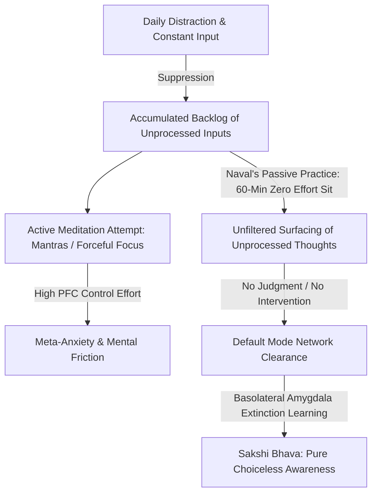

# Choiceless Awareness & Passive Meditation

> **Core Insight (TL;DR):** Meditation is not a mental discipline or a skill to perform; it is the radical act of sitting down and doing absolutely nothing so your brain can finally digest its massive backlog of unprocessed thoughts, memories, and unresolved emotions. By abandoning all control, mantras, and deliberate focus, you transition from an active controller into *Choiceless Awareness*. This allows your neurobiological Default Mode Network to process and discharge accumulated psychological debt, leaving behind effortless clarity and internal sovereignty.

---

## 1. The Surface Struggle vs. The Hidden Mechanism

### The Surface Experience: Meditation as High-Stakes Performance
Most modern seekers approach meditation as another self-improvement task to conquer. They download apps, adopt rigid postures, repeat mantras, or forcefully direct their attention to their breath. Within two minutes, the mind rebels. A torrent of random thoughts, past regrets, future anxieties, and trivial song refrains floods the mental screen. 

The practitioner responds with frustration and self-judgment: *"I am terrible at meditating. My mind won't shut up. I can't focus."* They attempt to suppress the incoming thoughts with sheer executive willpower, turning a practice meant for internal peace into a tense battlefield. Eventually, meditation feels like agonizing labor, leading to abandonment of the practice altogether.

```
[ Active Meditation Strain ]
PFC Executive Control  --->  Suppression of Thoughts  --->  Meta-Anxiety ("Am I doing this right?")  --->  Mental Fatigue & Eventual Abandonment
```

### The Hidden Mechanism: The Unprocessed Mental Inbox
What is actually occurring when you sit down to meditate is not a failure of focus, but the opening of a heavily backlogged psychological inbox. Throughout modern daily life, your brain is bombarded with thousands of external inputs—notifications, social interactions, work stress, media, and emotional micro-traumas. Because you immediately leap from one stimulus to the next without quiet downtime, your brain has no opportunity to process these experiences.

Instead of being integrated, these inputs are pushed into a background processing queue. When you finally sit in silence with your eyes closed, your brain seizes its first available window of stillness to run through its unread "mental emails." The flood of racing thoughts is not a sign that meditation is failing; it is **the exact mechanism of healing**. The mind is discharging stored cognitive and emotional friction.

### Why Conventional Advice Fails
Conventional advice treats thought as an adversary to be vanquished through focus. It recommends anchoring your mind to a object—a breath, a flame, a visualization, or a mantra—and fighting off distraction. While concentration practices (*Dharana*) have specific tactical uses, enforcing them on a hyper-stimulated, backlogged brain is like slamming a lid on a boiling pressure cooker. 

By insisting on controlling your mind, you retain the active controller—the ego (*Ahamkara*). True meditation does not occur when the ego successfully controls the mind; meditation is what remains when the ego surrenders the urge to manage the mind entirely.

---

## 2. The Science & Philosophy Behind It

### Neurobiological Blueprint: DMN Clearance & Extinction Learning



#### 1. Default Mode Network (DMN) De-excitation & Background Consolidation
The **Default Mode Network (DMN)**—comprising the medial prefrontal cortex (mPFC), posterior cingulate cortex (PCC), and precuneus—is the brain's primary self-referential circuit. It is responsible for autobiographical memory, temporal projection, and ego-ic narrative construction. 

When you engage in active task-focused work, the DMN is suppressed by the Task-Positive Network (TPN). However, when you sit quietly without a prescribed task, the DMN activates to process unresolved internal models. 

In passive meditation, allowing the DMN to run unhindered without executive intervention from the dorsolateral prefrontal cortex (dlPFC) allows stored self-referential tension to resolve. Once the backlogged narrative threads finish playing out, the DMN naturally quiets down, leading to profound physiological stillness.

#### 2. Amygdala Decoupling & Fear Extinction
When suppressed thoughts and unpleasant memories surface during silence, they usually trigger a secondary emotional reaction governed by the **basolateral amygdala** and the **sympathetic nervous system** (increased heart rate, shallow breathing). 

By practicing passive, non-reactive observation, you engage in biological **extinction learning**. The **ventromedial prefrontal cortex (vmPFC)** signals the amygdala that the surfaced thought is not an immediate physical threat. Over time, the physiological charge attached to stored memories dissipates, decoupling the memory from somatic distress.

#### 3. Interoception & Insular Cortex Integration
Choiceless awareness shifts neural activity from abstract verbal processing (left hemisphere) to real-time interoception anchored in the **anterior insular cortex**. The insula integrates visceral bodily sensations, allowing you to observe emotional states as physical sensations (tightness in the chest, heat in the stomach) rather than conceptual crises.

---

### Yogic & Zen Philosophy: Sakshi Bhava & Samskara Discharge

| Concept | Traditional Sanskrit / Zen Term | Psychological & Biological Equivalent |
| :--- | :--- | :--- |
| **Observer Consciousness** | *Sakshi Bhava* (साक्षी भाव) | Non-judgmental awareness mediated by the Salience Network. |
| **Mental Backlog** | *Samskaras* (संस्कार) & *Vrittis* | Unprocessed emotional impressions and neurochemical memory loops. |
| **Ego / Controller** | *Ahamkara* (अहंकार) | Default Mode Network's self-referential identity loop. |
| **Passive Sitting** | *Shikantaza* (只管打坐) | "Just sitting"—dropping all techniques, goals, and manipulations. |
| **Choiceless Observation** | *Neti Neti* (नेति नेति) | Dissociation of pure awareness from transient objects of thought. |

#### 1. Samskara Uncoiling: Digesting Psychological Debt
In Vedic psychology, every unintegrated experience leaves an impression (*Samskara*) in the subterranean levels of the mind (*Chitta*). These Samskaras generate mental ripples (*Chitta Vrittis*). 

When you sit in passive meditation, you give these latent Samskaras permission to rise to the surface. As they rise, they manifest as random thoughts, emotions, memories, or physical restlessness. If you try to stop them, you push them back into the subconscious. If you observe them neutrally without choosing between them—practicing **Choiceless Awareness**—their latent energy (*Karma*) burns off, permanently purifying the mind.

#### 2. Sakshi Bhava: Shifting from Thinker to Witness
The fundamental discovery of passive meditation is the separation of the *Seer* (*Drashta*) from the *Seen* (*Drishya*). 

Under normal conditioning, the ego (*Ahamkara*) identifies completely with whatever thought appears: *"I am anxious," "I am angry," "I need to check my phone."* In Choiceless Awareness, you establish yourself in **Sakshi Bhava**—the pure witness state. Thoughts, emotions, and physical sensations arise and fall like weather patterns in the sky, while your underlying awareness remains untouched.

---

## 3. The Paradigm Shift

```
Old Paradigm: Meditation is a technique I perform to control my mind and achieve quietness.
                              │
                              ▼
New Paradigm: Meditation is what naturally happens when I stop doing everything else and let my mind clean itself.
```

### The Art of Doing Nothing
Naval Ravikant defines meditation with radical simplicity: **"Meditation is turning off self-judgment."** It is not a skill you build; it is the cessation of all doing. 

When you stop trying to change your state, stop trying to become enlightened, and stop trying to suppress bad thoughts, the conflict within your consciousness collapses. The mind is a self-cleaning organ. Just as your physical body heals a wound if left untouched, your mind processes its internal backlog if you stop interfering with it.

### The Inbox Analogy
Imagine your mind is an email inbox that has accumulated 10,000 unread messages over decades. 
* **Active concentration** (mantras, breathing exercises) is like setting up complex spam filters that move the emails out of sight, but leave the inbox full.
* **Passive meditation** is opening the inbox, setting your hands down, and letting the server process every single email one by one until the inbox reaches Zero Unread Messages. 

The early stages of passive meditation will feel messy and overwhelming because you are finally opening the flooded inbox. But once the backlog is digested, true, effortless quietude emerges.

---

## 4. Actionable Protocol & Implementation Guide

```
[ Phase 1: Micro-Sit ] ──> [ Phase 2: The 60-Day Self-Guided Protocol ] ──> [ Phase 3: Choiceless Living ]
10 Min Zero-Effort Sit       60 Mins/Day First Thing in Morning             Micro-pauses without inputs
```

### Step 1: Immediate Micro-Action (Today)
**The 10-Minute Zero-Effort Sit**
1. Set a gentle timer for 10 minutes.
2. Sit comfortably in a chair or on a cushion with your back supported. Close your eyes.
3. **Drop all rules.** Do not focus on your breath. Do not use a mantra. Do not try to clear your mind.
4. Let your brain think whatever it wants to think. If it wants to replay an argument from 5 years ago, let it. If it wants to plan dinner, let it.
5. Your sole instruction: **Do not intervene.** Do not judge any thought as "bad" or "unmeditative." Treat all mental content like background street noise.

---

### Step 2: Cognitive & Meditative Practice
**The 60-Day Self-Guided Passive Meditation Protocol**

To completely clear your mental backlog and experience permanent shifts in baseline awareness, commit to Naval Ravikant’s **60-Day Protocol**:

| Parameter | Execution Rule |
| :--- | :--- |
| **Duration & Timing** | **60 continuous minutes every morning**, immediately upon waking. No exceptions. |
| **Environment** | Silent room, eyes closed, comfortable posture (chair or floor). No background audio. |
| **Technique** | **Zero technique.** Absolute surrender of control. |
| **Handling Distraction** | Welcome all thoughts, images, anxieties, and sensations without preference. |
| **Handling Physical Discomfort** | Adjust posture gently if pain is sharp, but remain physically still as much as possible to observe somatic restlessness. |

#### Navigating the 3 Stages of the Protocol:

```
Stage 1: The Storm (Days 1–20)    ──>  Stage 2: The Discharge (Days 21–40)  ──>  Stage 3: Choiceless Peace (Days 41–60)
Surfacing of acute emotional debt        Replay of ancient memories & fantasies      Effortless witness consciousness
```

1. **Days 1–20: The Storm (Acute Backlog Clearance)**
   * *What happens:* High restlessness, vivid worries, urge to check your phone, frustration.
   * *Protocol:* Remind yourself that this storm is the toxic residue leaving your system. Do not resist it.
2. **Days 21–40: The Discharge (Subconscious Digesting)**
   * *What happens:* Random childhood memories, strange dream-like imagery, sudden unexpected creative insights, followed by long stretches of mental neutral gear.
   * *Protocol:* Do not cling to creative insights or write them down during the hour. Let them pass like everything else.
3. **Days 41–60: Choiceless Peace (Baseline Realization)**
   * *What happens:* The backlogged inbox nears empty. The mind naturally quiets without effort. The gap between thoughts expands. You discover the abiding background observer (*Sakshi*).

---

### Step 3: Long-Term Habit Calibration
**Integrating Choiceless Awareness into Daily Life**

1. **Input Friction Micro-Pauses:** When waiting in line, sitting in traffic, or waiting for a meeting to start, intentionally refrain from pulling out your smartphone. Convert these daily gaps into 30-second Choiceless Awareness pauses.
2. **The "Non-Intervention" Reframe:** When hit by a sudden wave of emotion (anger, sadness, anxiety) during the workday, step back mentally for 10 seconds and practice non-intervention. Observe the biological sensation in your chest or throat without trying to fix it or explain it.
3. **Protecting Morning Quietude:** Maintain at least 30 minutes of input-free solitude upon waking every morning to digest the previous day's experiences before absorbing new inputs.

---

## 5. Diagnostic Self-Inquiry

Use these three reflection prompts to evaluate your internal relationship with meditation and thought:

1. **Am I using meditation techniques as a covert tool to control and suppress my mind because I am terrified of what will surface in silence?**
2. **When an unpleasant memory or embarrassing thought arises during stillness, do I judge myself for having the thought, or can I let it play out like a movie scene?**
3. **How much of my daily mental exhaustion comes from actively trying to manage, steer, and edit my thoughts instead of letting them dissolve on their own?**

---

## 6. Related Concepts & Next Steps in the Wiki

* [The Art of Sitting Comfortably with Yourself](file:///C:/Users/Asus/.gemini/antigravity/scratch/healthygamer_knowledge_base/articles_naval/n4.2-art-of-sitting-with-yourself.md) — How to confront internal solitude and eliminate phone-checking compulsions.
* [Death, Mortality & The Cosmic Reframe](file:///C:/Users/Asus/.gemini/antigravity/scratch/healthygamer_knowledge_base/articles_naval/n4.3-death-mortality-cosmic-reframe.md) — Using mortality salience to strip away trivial anxiety and drop egoic control.
* [The Ego, Conditioning & Untangling Beliefs](file:///C:/Users/Asus/.gemini/antigravity/scratch/healthygamer_knowledge_base/articles_naval/n2.2-ego-conditioning-untangling-beliefs.md) — Deconstructing the Ahamkara and mental constructs that prevent awareness.
* [Desire is a Contract You Make with Yourself to Be Unhappy](file:///C:/Users/Asus/.gemini/antigravity/scratch/healthygamer_knowledge_base/articles_naval/n3.2-desire-contract-unhappiness.md) — How desire interrupts peace and fuels mental chatter.
* [Science of Meditation & Mind Types](file:///C:/Users/Asus/.gemini/antigravity/scratch/healthygamer_knowledge_base/articles/4.2-science-of-meditation-mind-types.md) — Western neuroscience perspectives on meditation modalities.
