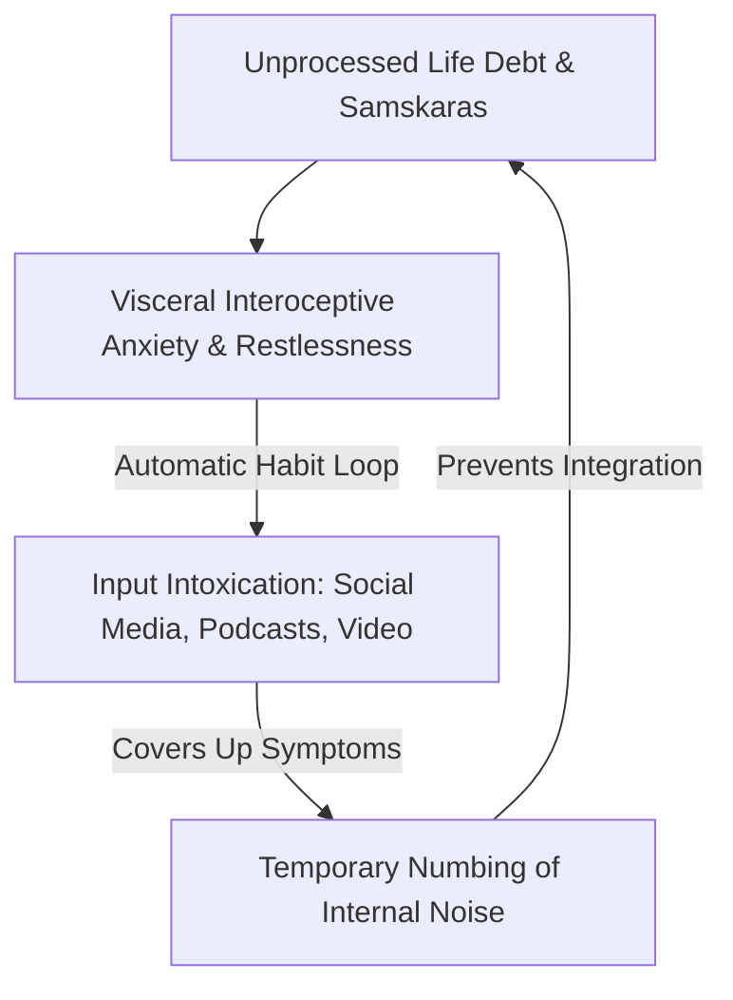
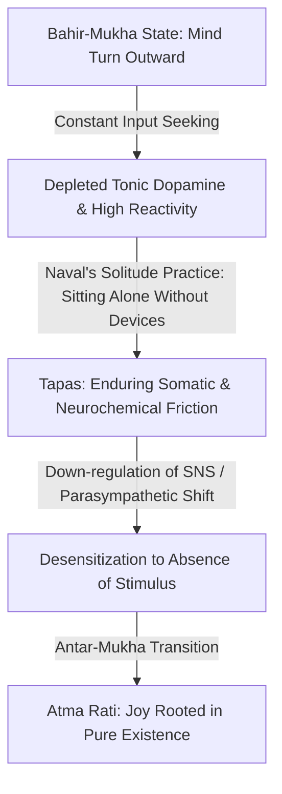

# The Art of Sitting Comfortably with Yourself

> **Core Insight (TL;DR):** Blaise Pascal famously wrote that all of humanity's problems stem from man's inability to sit quietly in a room alone. The compulsive urge to check your phone, play podcasts in the background, or constantly seek external stimulation is not a character flaw; it is an escape hatch from suppressed mental debt and somatic restlessness. Real peace begins when you cultivate internal solitude—confronting your unprocessed psychological backlog without digital anesthetic until your own mind becomes a comfortable, tranquil place to inhabit.

---

## 1. The Surface Struggle vs. The Hidden Mechanism

### The Surface Experience: The Phantom Itch of Solitude
Notice what happens during an ordinary day when a gap in activity occurs. You arrive early at a restaurant, stand in line for coffee, or stop at a red light. Within three seconds of non-activity, an intense physical compulsion drives your hand into your pocket to grab your smartphone. 

If forced to sit in a quiet room with no phone, no music, and no task for 30 minutes, an overwhelming sense of restlessness, boredom, and itchiness sets in. The body feels fidgety, the heart rate slightly elevates, and a subtle sense of panic bubbles up under the surface. Most people conclude, *"I am just not good at doing nothing,"* or *"I get bored easily,"* and immediately seek external distraction.

```
[ The Escape Loop of Distraction ]
Micro-Gap in Stimulus  --->  Somatic Restlessness & Drops in Dopamine  --->  Reflexive Phone Grab  --->  Temporary Relief & Deepening Mental Debt
```

### The Hidden Mechanism: Running from the Internal Noise
The constant reaching for external inputs is not driven by genuine curiosity; it is a defensive reaction. Over years of avoiding stillness, your mind accumulates a vast reservoir of unresolved micro-traumas, unexamined decisions, repressed feelings of inadequacy, and existential uncertainty. 

When external inputs stop, the noise inside your head naturally amplifies. The quiet room acts as a mirror, reflecting your unprocessed internal conflict. Your reflexive reaching for your phone is an attempt to apply a digital anesthetic to numb that emerging internal noise. 



### Why Conventional Advice Fails
Standard productivity advice treats phone addiction as a simple time-management issue or a failure of self-discipline. It prescribes app blockers, grayscale screens, or strict screen-time limits. 

However, if you remove the phone without resolving the underlying somatic restlessness and mental debt, the mind simply routes its escape through other channels: workaholic over-commitment, chronic caffeine use, compulsively cleaning the house, or endless mental daydreaming. The root issue is not the technology; it is your inability to tolerate your own internal baseline.

---

## 2. The Science & Philosophy Behind It

### Neurobiological Blueprint: Dopaminergic Tonicity & Somatosensory Interoception

#### 1. Tonic vs. Phasic Dopamine Depletion
The brain operates on two forms of dopaminergic signaling:
* **Phasic Dopamine:** Rapid, high-amplitude bursts triggered by novelty, notifications, sugar, or social media likes.
* **Tonic Dopamine:** The steady, underlying baseline level of dopamine in the nucleus accumbens that determines your background sense of well-being and contentment.

Chronic exposure to hyper-stimulating digital inputs creates high-frequency phasic spikes while systematically lowering your **tonic dopamine baseline**. When you sit alone in a room without inputs, the absence of novelty causes a sharp drop in dopamine signaling below your baseline. This neurochemical deficit is experienced subjectively as a painful physical itch, profound boredom, and physical restlessness.

```
High-Spike Digital Lifestyle  ==>  Depressed Tonic Baseline  ==>  Stillness Experienced as Withdrawal / Boredom
```

#### 2. Insular Cortex & Interoceptive Alarm Signals
The **anterior insular cortex** monitors interoception—the internal somatic state of the body (heart rate, gut tension, respiratory rate). In individuals accustomed to constant distraction, emerging emotional tension manifests as subtle visceral discomfort (a tight chest or stomach drop). 

Because the prefrontal cortex lacks practice processing these somatic signals without distraction, the amygdala misinterprets interoceptive awareness as an acute environmental threat, triggering a subtle fight-or-flight sympathetic response.

#### 3. Autonomic Nervous System Hyperarousal
The inability to sit still is rooted in an overactive **sympathetic nervous system (SNS)** and a suppressed **vagal tone (parasympathetic system)**. Immobility in a state of unintegrated stress feels biologically dangerous—like staying motionless while a predator lurks nearby. True solitude requires activating the ventral vagal pathway of the parasympathetic system, sending safety signals down the vagus nerve to slow the heart rate and drop muscular tension.

---

### Yogic & Philosophical Perspective: Atma Rati & Tapas

| Concept | Traditional Sanskrit / Philosophical Term | Psychological & Biological Equivalent |
| :--- | :--- | :--- |
| **Outward-Facing Mind** | *Bahir-Mukha* (बहिर्मुख) | High-phasic dopamine reliance on external inputs. |
| **Inward-Facing Mind** | *Antar-Mukha* (अंतर्मुख) | Parasympathetic regulation & interoceptive peace. |
| **Friction / Self-Discipline** | *Tapas* (तपस्) | Neuroplastic neurochemical adaptation through enduring boredom. |
| **Self-Delight** | *Atma Rati* (आत्मरति) | High tonic dopamine baseline; joy rooted in pure presence. |
| **Solitude vs. Loneliness** | Stoic / Zen Solitude | Non-attachment to external validation (*Vairagya*). |



#### 1. Bahir-Mukha to Antar-Mukha: Retraining Consciousness
Vedic psychology distinguishes between *Bahir-mukha* (consciousness directed outward toward sense objects) and *Antar-mukha* (consciousness turned inward toward the self). 

When the mind is exclusively *Bahir-mukha*, it becomes entirely dependent on external conditions for stability. Sitting comfortably with yourself requires executing the pivot to *Antar-mukha*—discovering that the observer inside is naturally tranquil, silent, and whole.

#### 2. Tapas: Burning Away the Addictive Itch
In Yogic philosophy, **Tapas** translates to psychological heat or voluntary friction. When you sit in silence and resist the urge to check your phone, you generate internal *Tapas*. This friction burns away the mental attachments (*Vasanas*) that drive compulsive behavior. The discomfort you feel while sitting still is the exact sensation of neuroplastic rewiring.

#### 3. Solitude vs. Loneliness (Naval’s Distinction)
Naval Ravikant emphasizes that **loneliness is the poverty of self; solitude is the richness of self.** 
* *Loneliness* is driven by the ego feeling abandoned by others and craving external validation.
* *Solitude* is the deep enjoyment of your own consciousness. When you become your own best friend, being alone ceases to feel empty—it feels like coming home.

---

## 3. The Paradigm Shift

```
Old Paradigm: Silence is an empty vacuum that must be filled with inputs, noise, and entertainment.
                              │
                              ▼
New Paradigm: Silence is the fundamental baseline of reality; inputs are temporary disturbances within it.
```

### Befriending Your Internal Baseline
Most people treat their mind like an unruly stranger or a hostile room they must escape through distraction. The ultimate shift in internal sovereignty occurs when you decide to **make peace with your baseline mind**. 

If your internal baseline is messy, anxious, or bored, running away from it guarantees that it will remain messy forever. Staying in the room with yourself—confronting the boredom, observing the restlessness, and listening to the internal noise without running—eventually clears the noise.

### Micro-Panics Disguised as Curiosity
Realize that every automatic urge to check your phone, open a tab, or turn on background video is a **micro-panic attack in disguise**. 

It is a subtle signal from your nervous system declaring: *"I cannot tolerate this present moment of zero input."* Once you recognize that checking your phone is a stress response rather than an act of free choice, you gain the power to stop and choose stillness instead.

---

## 4. Actionable Protocol & Implementation Guide

```
[ Level 1: Input Friction ] ──> [ Level 2: The Solo Silent Walk ] ──> [ Level 3: The 1-Hour Solitude Sit ]
Eliminate ambient background noise     30-60 min walk with ZERO tech        60 min sit with zero task/input
```

### Level 1: The Input-Friction Micro-Protocol (Daily Integration)

#### Rule 1: The First & Last 30 Minutes
* **Morning:** For the first 30 minutes after waking, do not touch your phone, check messages, or listen to media. Allow your brain to transition naturally into baseline waking state.
* **Evening:** Turn off all screens 30 minutes before sleep. Allow your mind to wind down without high-phasic dopamine spikes.

#### Rule 2: Single-Task Transitions
* Remove background podcasts, music, and YouTube videos during daily chores (doing dishes, folding laundry, walking between meetings, eating meals alone).
* Treat every chore as a practice in returning to sensory presence.

---

### Level 2: The Solo Silent Walk Protocol (Weekly Practice)

```
[ Preparation ]                [ Execution ]                  [ Integration ]
Leave all technology at home    Walk in nature or city streets  Observe urge to record/share
No headphones, no tracking      Do not try to solve problems    Experience natural baseline reset
```

1. **Setup:** Set aside 45 to 60 minutes once per week. Leave your phone, smartwatch, and headphones at home (or store them completely powered off in a backpack for emergency use only).
2. **Execution:** Walk at a comfortable, unhurried pace. 
3. **Internal Stance:**
   * Do not attempt to produce "brilliant thoughts" or solve life problems.
   * Observe external scenery without taking photos or planning to tell anyone about it.
   * When the mental urge arises to take a photo or share an experience on social media, notice the egoic craving for external validation (*Bahir-mukha*) and let it dissolve.

---

### Level 3: Naval's 1-Hour Solitude Sit (Master Protocol)

To permanently break the compulsion for digital escape and cultivate self-acceptance, execute the **1-Hour Solitude Sit**:

| Protocol Element | Exact Implementation Guideline |
| :--- | :--- |
| **Time & Space** | 60 unbroken minutes. A quiet room with natural light. Comfortable chair or cushion. |
| **Tech Isolation** | All electronic devices stored in a separate room, turned off. |
| **Physical Stance** | Sit comfortably with eyes open or closed. Adjust posture when needed, but refrain from fidgeting. |
| **Mental Stance** | **Zero Task.** You are not allowed to read, write, listen to music, or perform guided meditation. |
| **Managing Restlessness** | When severe boredom or anxiety arises, label it somatically: *"Restlessness in chest," "Tightness in shoulders."* Do not act on it. |

#### Expected Neurochemical Timeline During the 1-Hour Sit:

```
0–15 Mins: Acute Withdrawal ──> 15–35 Mins: Mental Debris ──> 35–60 Mins: Baseline Tranquility
High dopamine craving           Surfacing of past debt        Parasympathetic reset & quiet joy
```

1. **Minutes 0–15 (Acute Withdrawal):** High impulse to stand up, check the clock, or look around. Neurochemical withdrawal from phasic dopamine.
2. **Minutes 15–35 (Surfacing Debris):** Waves of random memories, unmade decisions, and emotional residue. The mind attempts to entertain itself through daydreaming.
3. **Minutes 35–60 (Baseline Tranquility):** Parasympathetic activation occurs. The nervous system accepts that no inputs are coming. A deep, cool sense of physical relief and internal quietude settles in.

---

## 5. Diagnostic Self-Inquiry

Evaluate your level of internal solitude with these three diagnostic prompts:

1. **Can I sit quietly in a chair in an empty room for 30 minutes without a phone, book, or task, feeling completely peaceful and content?**
2. **When I am alone in transit or waiting in line, do I reach for my phone because I genuinely need information, or because I am escaping somatic boredom?**
3. **If all external validation, attention, and digital connectivity were stripped away for one week, would I enjoy my own company or panic?**

---

## 6. Related Concepts & Next Steps in the Wiki

* [Choiceless Awareness & Passive Meditation](file:///C:/Users/Asus/.gemini/antigravity/scratch/healthygamer_knowledge_base/articles_naval/n4.1-choiceless-awareness-meditation.md) — The fundamental mechanics of zero-effort meditation.
* [Death, Mortality & The Cosmic Reframe](file:///C:/Users/Asus/.gemini/antigravity/scratch/healthygamer_knowledge_base/articles_naval/n4.3-death-mortality-cosmic-reframe.md) — Overcoming existential dread and small-scale self-importance.
* [Happiness as a Learned Skill](file:///C:/Users/Asus/.gemini/antigravity/scratch/healthygamer_knowledge_base/articles_naval/n3.1-happiness-learned-skill.md) — Cultivating internal state independence and baseline contentment.
* [Digital Compulsions & Doomscrolling](file:///C:/Users/Asus/.gemini/antigravity/scratch/healthygamer_knowledge_base/articles/1.5-digital-compulsions-doomscrolling.md) — Neurobiology of digital dopamine loops and breaking input addiction.
* [Sensory Overload & Modern Information Diet](file:///C:/Users/Asus/.gemini/antigravity/scratch/healthygamer_knowledge_base/articles/7.4-sensory-overload-modern-information-diet.md) — Architecture for protecting your mental environment.
