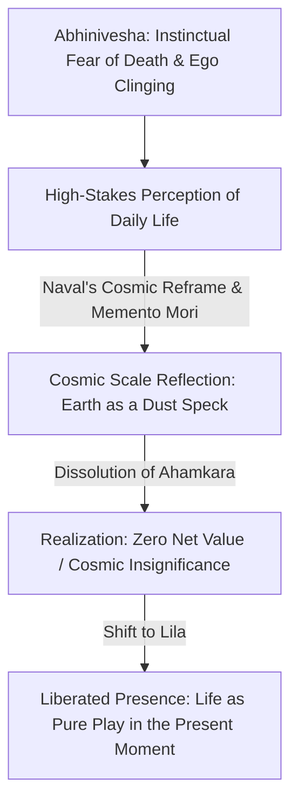

# Death, Mortality & The Cosmic Reframe

> **Core Insight (TL;DR):** On a cosmic timeline, your life is a brief flash of light between two infinite dark oceans; in 100 years, everyone you know will be dead and forgotten, and the Earth will continue spinning as if you never existed. Far from being depressing, this realization is the ultimate liberating key: when nothing you do matters in the cosmic scale, the suffocating pressure of life collapses, leaving you free to drop status games, embrace radical presence, and treat life as a joyful play (*Lila*) rather than a high-stakes survival test.

---

## 1. The Surface Struggle vs. The Hidden Mechanism

### The Surface Experience: Living in a High-Stakes Pressure Cooker
Most human beings move through their daily lives trapped in an state of micro-panic. A snub from a coworker, a failed business deal, a awkward social moment, or a missed deadline triggers acute physiological distress. We treat minor social setbacks with the same evolutionary severity as an impending physical disaster. 

Simultaneously, an underlying fear of death and non-existence manifests as existential dread, leading to obsessive pursuits of legacy, status, wealth, and permanent achievement. We spend our lives preparing to live, postponing peace until future milestones are reached, only to find that the horizon keeps receding.

```
[ Egoic High-Stakes Trajectory ]
Perceived Social Failure  --->  Egoic Mortality Threat  --->  Chronic Stress & Anxiety  --->  Legacy Obsession & Postponed Living
```

### The Hidden Mechanism: The Ego's Illusion of Centrality
The human brain is an evolutionary survival engine that constructs a powerful narrative ego (*Ahamkara*). To ensure your physical survival in ancestral hunter-gatherer tribes, the ego convinced you that **you are the absolute center of the universe** and that social ostracization or failure equals literal biological death.

This ancestral survival code is catastrophically miscalibrated for the modern world:
* It treats small reputation hits as fatal threats.
* It projects your personal identity into an indefinite future, attempting to achieve immortality through fame, assets, or legacy.
* It blinds you to the blinding truth of your own cosmic insignificance.

```mermaid
graph TD
    A[Ancestral Survival Brain & Ahamkara] -->|Illusion of Permanence| B[Ego Centrality: "I am the center of reality"]
    B -->|Social Failure / Mistake| C[Acute Survival Threat Response: Amygdala & dACC Activation]
    C -->|Defense Mechanism| D[Status Competition, Over-working & Anxiety]
    D -->|Prevents Presence| E[Chronic Fear of Death & Regret]
```

### Why Conventional Advice Fails
Conventional self-help attempts to soothe mortality anxiety and low self-esteem by **inflating the ego**. It urges you to "build an empire," "leave a lasting legacy," or "make your mark on history." 

This advice reinforces the very illusion that causes the distress. By assuring you that your accomplishments are profoundly important, it cranks up the stakes of every action. When you believe your life’s legacy is sacred, every mistake becomes a tragedy. Real freedom does not come from inflating your importance to match your ego; it comes from deflating your ego to match reality.

---

## 2. The Science & Philosophy Behind It

### Neurobiological Blueprint: Terror Management & PCC Down-Regulation

#### 1. Terror Management Theory (TMT) & Cortical Neural Architecture
According to **Terror Management Theory (TMT)**, human culture and individual ambition are protective structures built to buffer against the implicit terror of inevitable death (*mortality salience*). 

When mortality salience is triggered, neuroimaging shows heightened activation in the **dorsal anterior cingulate cortex (dACC)**—the brain's alarm system—and the **amygdala**. In response, the prefrontal cortex activates defensive mechanisms: doubling down on cultural worldviews, seeking in-group approval, and engaging in hyper-competitive status signaling.

#### 2. DMN Posterior Cingulate Cortex (PCC) Down-Regulation
The **posterior cingulate cortex (PCC)** within the Default Mode Network is the core neural node for egoic self-location and narrative self-importance. 

When an individual undergoes a profound **cosmic reframe**—whether through deep meditation, awe experiences, or mortality contemplation—the functional connectivity of the PCC drops precipitously. This neurobiological shift shifts the nervous system out of sympathetic threat dominance and into a **vagal parasympathetic state**, accompanied by subjective feelings of cosmic awe, boundarylessness, and liberation.

```
Contemplation of Cosmic Scale  ==>  PCC Deactivation (DMN)  ==>  Collapse of Ego Boundaries  ==>  Parasympathetic Vagal State & Awe
```

---

### Yogic, Stoic & Zen Philosophy: Abhinivesha & Lila

| Concept | Philosophical / Sanskrit Term | Modern Psychological Equivalent |
| :--- | :--- | :--- |
| **Clinging to Life / Fear of Death** | *Abhinivesha* (अभिनिवेश) | Biological survival drive & Terror Management Defense. |
| **Cosmic Play** | *Lila* (लीला) | Frame-shift: Life as an intrinsic game rather than a survival test. |
| **Remember Mortality** | *Memento Mori* | Conscious mortality salience used as a perspective filter. |
| **Unchanging Witness** | *Purusha* (पुरुष) | De-identified pure awareness immune to physical decay. |
| **Net Value of Creation** | Zero Net Cosmic Value | Reduction of performance anxiety through cosmic scale. |



#### 1. Abhinivesha: The Primary Root of Anxiety
In Patanjali’s Yoga Sutras, **Abhinivesha** (the instinctual cling to life and fear of annihilation) is identified as the subtle, universal Klesha (affliction) underlying all human suffering. Even wise individuals remain unconsciously bound by *Abhinivesha*. Every micro-anxiety you experience—fear of public speaking, fear of rejection, fear of bankruptcy—is simply a diluted fragment of *Abhinivesha*.

#### 2. Memento Mori & Stoic Decoupling
The Stoic practice of **Memento Mori** ("Remember that you must die") is not a morbid obsession with death, but an intentional recalibration of perception. Marcus Aurelius observed: *"You could leave life right now. Let that determine what you do and say and think."* Contemplating your death strips away artificial social conditioning, leaving behind only what is authentic and real.

#### 3. Lila: The Universe as Divine Play
In Vedanta and Samkhya philosophy, the creation and dissolution of universe cycles is called **Lila**—the divine play of consciousness. 

Life is not a corporate performance review; it is a temporary dance. A dance has no destination; the point of dancing is not to reach a specific spot on the floor, but to enjoy every movement while the music plays.

---

## 3. The Paradigm Shift

```
Old Paradigm: My life is a high-stakes test of achievement where failure is catastrophic and legacy must be secured.
                              │
                              ▼
New Paradigm: I am a temporary arrangement of stardust on a tiny rock; nothing I do matters cosmically, so I am completely free.
```

### The Ultimate Liberation: Zero Net Cosmic Value
Naval Ravikant articulates the cosmic reframe with uncompromising clarity:

> *"You're going to die and none of this matters. So enjoy yourself. Do something useful. Add value. Express love. Don't hurt anybody. But don't take yourself so seriously."*

If you zoom out to a cosmic timeline:
* The universe is 13.8 billion years old and will continue for trillions more.
* Planet Earth is a speck of dust on the edge of an average galaxy containing 100 billion stars.
* In 100 years, every person currently alive will be dead. In 500 years, all your accomplishments will likely be forgotten dust.

This realization is not depressing; it is **the ultimate key to freedom**. If your life has zero net value to the universe, the terrifying weight of your existence vanishes. You are playing with house money.

```
[ The Cosmic Scale Cascade ]
Earth = Speck of Dust  ──>  Human Life = 80-Year Flash  ──>  Legacy = Forgotten  ──>  Result: Total Present Freedom
```

### From Serious to Sincere
When you embrace mortality, you transition from being **serious** to being **sincere**:
* **Seriousness** is egoic: it stems from believing that the outcome of your efforts defines your fundamental worth and that the universe depends on your success.
* **Sincerity** is soul-level: it stems from realizing that because your time is short, you should engage with the present moment with wholehearted devotion, love, and honesty—without clinging to the results.

---

## 4. Actionable Protocol & Implementation Guide

```
[ Micro-Filter ] ──> [ Daily Contemplation Protocol ] ──> [ Life Architecture ]
100-Year Perspective Test  3-Minute Evening Memento Mori  Living in Unconditional Present Tense
```

### Step 1: Immediate Micro-Action (Today)
**The 100-Year Perspective Filter**

Whenever you feel a sudden surge of acute stress, embarrassment, or decision paralysis today, stop and execute the **100-Year Filter**:

1. Pause and take one deep breath.
2. Ask yourself: **"Will this issue matter in 100 years?"**
3. Ask yourself: **"Will I matter in 100 years?"**
4. Observe the immediate drop in heart rate as your prefrontal cortex recalibrates the situation from a "survival crisis" to a temporary event.

---

### Step 2: Cognitive & Meditative Practice
**The Cosmic Zoom-Out & Evening Memento Mori Protocol**

Execute this 5-minute visualization exercise every evening before sleep:

```
[ Step 1: Egoic Center ] ──> [ Step 2: Global Scale ] ──> [ Step 3: Cosmic Void ] ──> [ Step 4: Present Re-entry ]
Visualize current body       Zoom out to Earth        Zoom out to Galaxy        Return to room with gratitude
```

#### Exercise Breakdown:

1. **Step 1: The Local Observer (60 Seconds)**
   * Sit quietly in bed. Close your eyes and sense your physical body in the room. Feel your heart beating and your chest rising.
2. **Step 2: The Planetary Scale (60 Seconds)**
   * Mentally zoom out 100 miles above your home. See your city as a tiny grid of light. Zoom out to see the blue sphere of Earth hanging in space. Recognize that 8 billion human beings are currently experiencing their own intense dramas on that sphere.
3. **Step 3: The Cosmic Scale & Mortality (60 Seconds)**
   * Zoom out beyond the solar system into the Milky Way galaxy. See our sun as one grain of sand among billions. 
   * Contemplate the vast stretches of time before your birth, and the infinite stretches of time after your death. Contemplate your own inevitable physical end. Let the ego collapse into the cosmic void.
4. **Step 4: The Re-entry of Pure Gratitude (60 Seconds)**
   * Zoom all the way back down into your body sitting in the room. Open your eyes. 
   * Realize: *You are alive right now.* You have been granted a temporary ticket to experience this cosmic play. Treat the remaining hours of your life as a gift, not a burden.

---

### Step 3: Long-Term Habit Calibration
**Architecting a Life of Unconditional Presence**

1. **Eliminate the "I Will Be Happy When..." Trap:**
   * Recognize that postponing happiness until retirement, financial freedom, or marriage is an illusion rooted in ignoring mortality. Death does not wait for your goals to finish. Decide to be happy right now, as an unconditioned choice.
2. **Drop Status Competitions:**
   * Stop spending energy competing for artificial status markers (prestige titles, luxury signals, public approval). Remember that the grave levels all status games instantly. Play games that are intrinsically rewarding (*Lila*).
3. **Express Radical Truth & Love Today:**
   * Do not store up unspoken appreciation or apologies. Treat every interaction with loved ones as if it could be the final time you speak to them. This eliminates future regret.

---

## 5. Diagnostic Self-Inquiry

Evaluate your relationship with mortality and existential perspective using these three prompts:

1. **Am I postponing genuine peace, presence, and joy until a future date because I am pretending I will live forever?**
2. **If I knew with absolute certainty that I would die in 12 months, what status games, worries, and superficial activities would I drop immediately?**
3. **When I fail at a task, do I experience it as a temporary outcome in a cosmic play, or as a catastrophic hit to my identity?**

---

## 6. Related Concepts & Next Steps in the Wiki

* [Choiceless Awareness & Passive Meditation](file:///C:/Users/Asus/.gemini/antigravity/scratch/healthygamer_knowledge_base/articles_naval/n4.1-choiceless-awareness-meditation.md) — How to cultivate the witness consciousness that survives egoic dissolution.
* [The Art of Sitting Comfortably with Yourself](file:///C:/Users/Asus/.gemini/antigravity/scratch/healthygamer_knowledge_base/articles_naval/n4.2-art-of-sitting-with-yourself.md) — Overcoming internal restlessness and befriending your solitude.
* [Overcoming Envy, Social Comparison & Status Games](file:///C:/Users/Asus/.gemini/antigravity/scratch/healthygamer_knowledge_base/articles_naval/n3.4-overcoming-envy-status-games.md) — Deconstructing artificial social hierarchies using the cosmic reframe.
* [Happiness as a Learned Skill](file:///C:/Users/Asus/.gemini/antigravity/scratch/healthygamer_knowledge_base/articles_naval/n3.1-happiness-learned-skill.md) — Choosing present-moment contentment over outcome dependence.
* [Grieving Unmet Potential](file:///C:/Users/Asus/.gemini/antigravity/scratch/healthygamer_knowledge_base/articles/3.4-grieving-unmet-potential.md) — Releasing idealised self-images and embracing impermanence.
